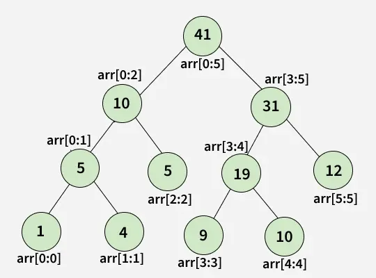

# Segment Tree
Segment Tree is a data structure that allows efficient querying and updating of intervals or segments of an array.

- It is particularly useful for problems involving range queries, such as finding the sum, minimum, maximum, or any other operation over a specific range of elements in an array.
- The tree is built recursively by dividing the array into segments until each segment represents a single element.
- This structure enables fast query and update operations with a time complexity of O(log n)

The following diagram shows a segment tree built for an array [1, 4, 5, 9, 10, 12] of size 6. The example tree is built for range sum queries. Every node stores sum of a range. The root nodes stores sum of the whole array and leaf nodes store sums of single elements in the array. Please refer Segment Tree [[Basics|Introduction]] article for details about construction and query.

## Basics of Segment Tree:

- [[Basics|Introduction]]
- Persistent Segment Tree
- Efficient implementation
- Iterative Segment Tree
- Range Sum and Update in Array
- Dynamic Segment Trees
- Applications, Advantages and Disadvantages

## Lazy Propagation:

- Lazy Propagation
- Lazy Propagation | Set 2
- Flipping Sign Problem

## Range Queries:

- Queries for any non-repeating element
- Range Minimum Query
- Querying maximum number of divisors
- Min-Max Range Queries in Array
- Range LCM Queries
- Number of primes in a subarray
- Largest Sum Contiguous Subarray
- Longest Correct Bracket Subsequence
- Maximum Occurrence in a Given Range
- Maximum product pair in range with updates
- Chessboard Pieces
- Number of subsets equal to a given String
- Minimum distance between two Zeros
- Queries to evaluate the given equation in a range [L, R]
- Maximum weight in given price range for Q queries

## Some interesting problem on Segment Tree:

- Longest Increasing Subsequences (LIS)
- Longest subarray consisting of same elements by at most K decrements
- Generate original permutation from given array of inversions
- Maximum of all subarrays of size K
- Build a segment tree for N-ary rooted tree
- Count number of increasing sub-sequences : O(NlogN)
- Calculate the Sum of GCD over all subarrays
- Cartesian tree from inorder traversal
- LIS using Segment Tree
- Reconstructing Segment Tree

## Applications of Segment Tree:

- Interval scheduling: Segment trees can be used to efficiently schedule non-overlapping intervals, such as scheduling appointments or allocating resources.
- Range-based statistics: Segment trees can be used to compute range-based statistics such as variance, standard deviation, and percentiles.
- Image processing: Segment trees are used in image processing algorithms to divide an image into segments based on color, texture, or other attributes.