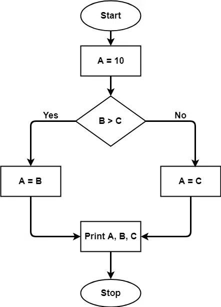

# Cyclomatic Complexity
Cyclomatic complexity, developed by Thomas McCabe, is a metric that measures the complexity of a program by counting its decision points. It measures the number of unique paths through the code, indicating how complex the logic is. Lower complexity suggests simpler, more manageable code, reducing the chances of errors and making it easier to maintain and modify. Essentially, it helps assess the code's readability and risk associated with changes.

## What is Cyclomatic Complexity?

The cyclomatic complexity of a code section is the quantitative measure of the number of linearly independent paths in it. It is a software metric used to indicate the complexity of a program. It is computed using the control flow graph of the program. The nodes in the graph indicate the smallest group of commands of a program, and a directed edge in it connects the two nodes i.e. if the second command might immediately follow the first command.

For example, if the source code contains no control flow statement then its cyclomatic complexity will be 1, and the source code contains a single path in it. Similarly, if the source code contains one if condition then cyclomatic complexity will be 2 because there will be two paths one for true and the other for false.

## Formula for Calculating Cyclomatic Complexity

Mathematically, for a structured program, the directed graph inside the control flow is the edge joining two basic blocks of the program as control may pass from first to second. So, cyclomatic complexity M would be defined as,

> M = E - N + 2P whereE = the number of edges in the control flow graph N = the number of nodes in the control flow graph P = the number of connected components

M = E - N + 2P

where

E = the number of edges in the control flow graph N = the number of nodes in the control flow graph P = the number of connected components

In case, when exit point is directly connected back to the entry point. Here, the graph is strongly connected, and cyclometric complexity is defined as

> M = E - N + PwhereE = the number of edges in the control flow graph N = the number of nodes in the control flow graph P = the number of connected components

M = E - N + P

where

E = the number of edges in the control flow graph N = the number of nodes in the control flow graph P = the number of connected components

In the case of a single method, P is equal to 1. So, for a single subroutine, the formula can be defined as

> M = E - N + 2whereE = the number of edges in the control flow graph N = the number of nodes in the control flow graph P = the number of connected components

M = E - N + 2

where

E = the number of edges in the control flow graph N = the number of nodes in the control flow graph P = the number of connected components

## How to Calculate Cyclomatic Complexity?

Steps that should be followed in calculating cyclomatic complexity and test cases design are:

Construction of graph with nodes and edges from code.

- Identification of independent paths.
- Cyclomatic Complexity Calculation
- Design of Test Cases

Let a section of code as such:

```
A = 10   IF B > C THEN      A = B   ELSE      A = C   ENDIFPrint APrint BPrint C
```

Control Flow Graph of the above code:



The cyclomatic complexity calculated for the above code will be from the control flow graph.

> The graph shows seven shapes(nodes), and seven lines(edges), hence cyclomatic complexity is 7-7+2 = 2.

The graph shows seven shapes(nodes), and seven lines(edges), hence cyclomatic complexity is 7-7+2 = 2.

## Use of Cyclomatic Complexity

- Determining the independent path executions thus proven to be very helpful for Developers and Testers.
- It can make sure that every path has been tested at least once.
- Thus help to focus more on uncovered paths.
- Code coverage can be improved.
- Risks associated with the program can be evaluated.
- These metrics being used earlier in the program help in reducing the risks.

## Advantages of Cyclomatic Complexity

- It can be used as a quality metric, given the relative complexity of various designs.
- It is able to compute faster than Halstead's metrics.
- It is used to measure the minimum effort and best areas of concentration for testing.
- It is able to guide the testing process.
- It is easy to apply.

## Disadvantages of Cyclomatic Complexity

- It is the measure of the program's control complexity and not the data complexity.
- In this, nested conditional structures are harder to understand than non-nested structures.
- In the case of simple comparisons and decision structures, it may give a misleading figure.

## Important Questions on Cyclomatic Complexity

### 1. Consider the following program module.

```
int module1 (int x, int y) {   while (x!=y){      if(x>y)         x=x-y,      else y=y-x;      }   return x;}
```

### What is the Cyclomatic Complexity of the above module? [GATE CS 2004]

(A) 1

(B) 2

(C) 3

(D) 4

Answer: Correct answer is (C).

### 2. With respect to software testing, consider a flow graph G with one connected component. Let E be the number of edges, N be the number of nodes, and P be the number of predicate nodes of G. Consider the following four expressions:

```
i. E-N+Pii. E-N+2iii. P+2iv. P+1
```

### The cyclomatic complexity of G is given by [GATE CS 2006]

(A) 1 or 3

(B) 2 or 3

(C) 2 or 4

(D) 1 or 4

Solution: Correct Answer is (C).

### 3. Consider the following statements about the cyclomatic complexity of the control flow graph of a program module. Which of these are TRUE? [ GATE-CS-2009 ]

```
I. The cyclomatic complexity of a module is equal to the maximum number of    linearly independent circuits in the graph.II. The cyclomatic complexity of a module is the number of decisions in the     module plus one,where a decision is effectively any conditional statement     in the module.III.The cyclomatic complexity can also be used as a number of linearly      independent paths that should be tested during path coverage testing. 
```

(A) I and II

(B) II and III

(C) I and III

(D) I, II and III

Solution: Correct Answer is (B).

### 4. Consider the following C program segment.

```
while (first <= last)
{
   if (array [middle] < search)
      first = middle +1;
   else if (array [middle] == search)
      found = True;
   else last = middle – 1;
   middle = (first + last)/2;
}
if (first < last) not Present = True;

```

### The cyclomatic complexity of the program segment is __________. [ GATE-CS-2015 (Set 1) ]

(A) 3

(B) 4

(C) 5

(D) 6

Solution: Correct Answer is (C).

## Conclusion

Cyclomatic complexity provides a clear measure of a program's complexity based on its decision-making structure. By counting independent paths, it helps assess code readability and identify areas prone to errors. While it aids in test case design and code improvement, it's crucial to remember its limitations, especially in interpreting nested structures and focusing solely on control complexity.