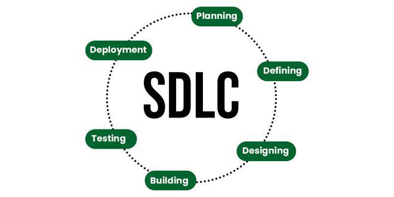
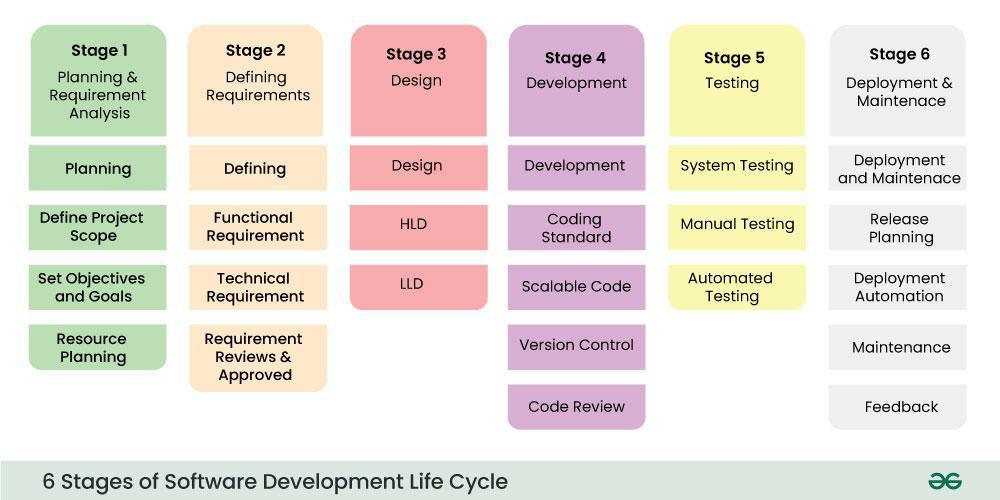
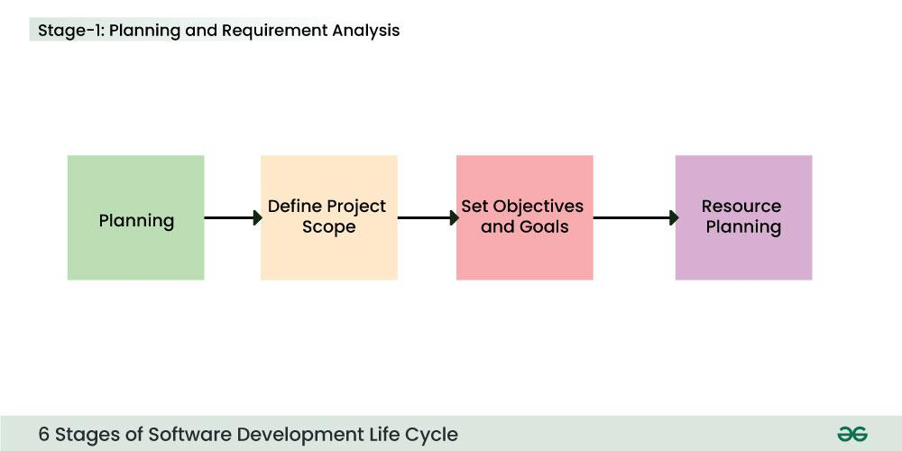
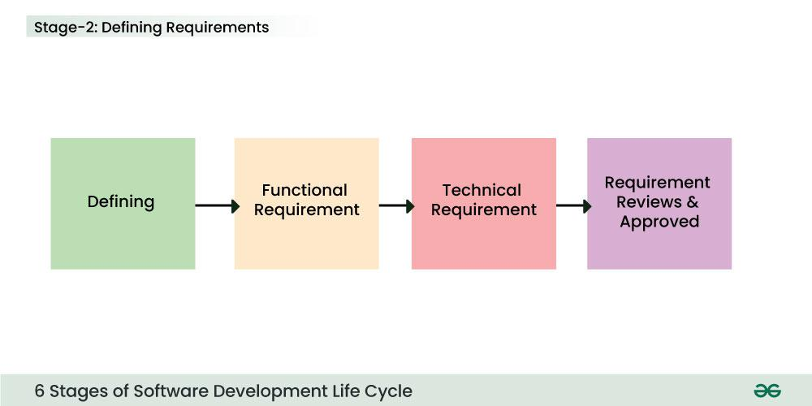
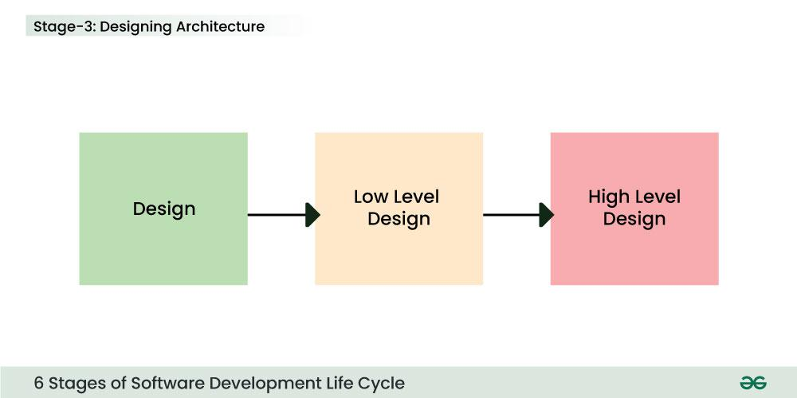
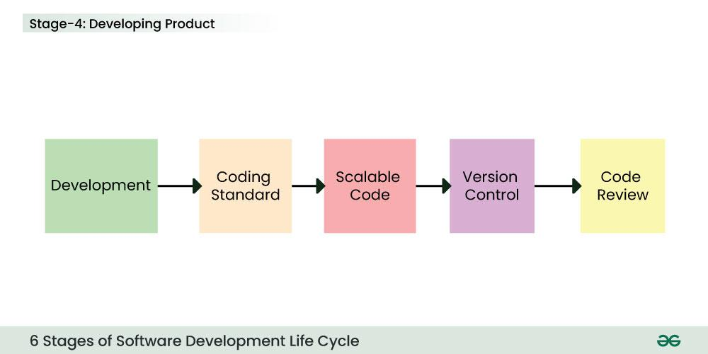
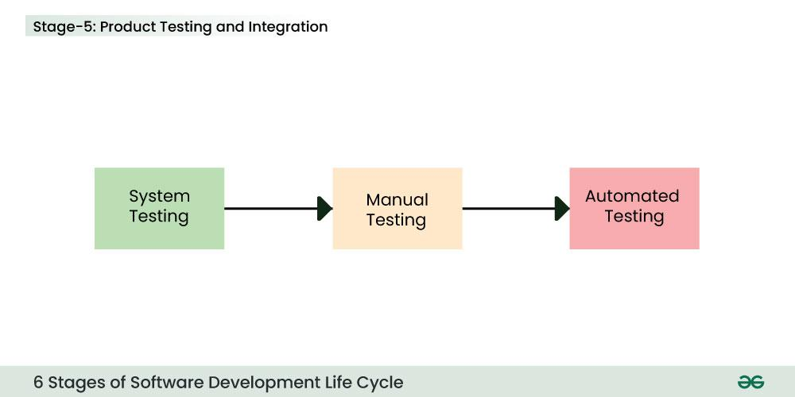
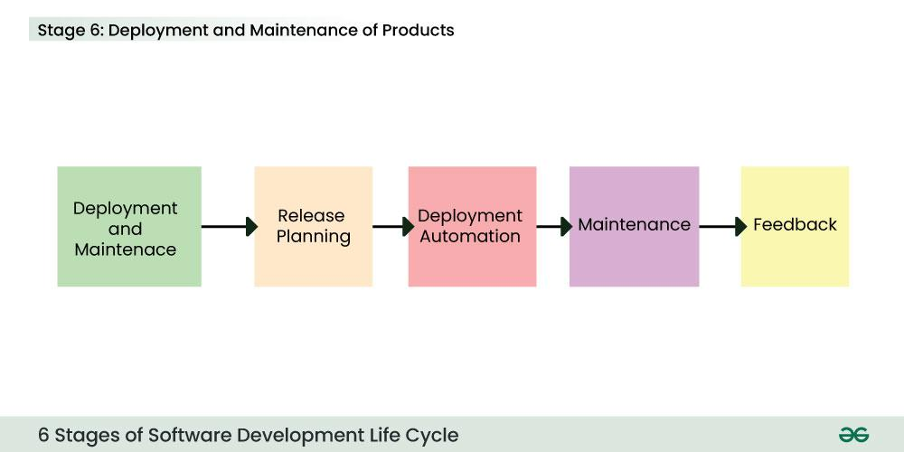

# Software Development Life Cycle (SDLC)
The Software Development Life Cycle (SDLC) is a structured framework used by software organizations to design, develop, and test high-quality software. It defines the entire process of software production, from the initial idea to the final deployment and maintenance.

The goal of the SDLC is to produce high-quality software that meets or exceeds customer expectations, reaches completion within time and cost estimates, and is efficient to maintain.

### Why is SDLC Important?

Without a structured SDLC, software development becomes chaotic. Teams may miss requirements, blow budgets, or deliver buggy code that doesn't solve the user's problem. SDLC provides:

- Visibility: Stakeholders know exactly what is happening at every stage.
- Quality Control: Testing is integrated into the process, not an afterthought.
- Risk Management: Potential pitfalls are identified during the planning phase.
- Cost Estimation: Helps in predicting timelines and budgets accurately.

## Stages of the Software Development Life Cycle

SDLC specifies the tasks to be performed at various stages by a software engineer or developer. It ensures that the end product is able to meet the customer's expectations and fits within the overall budget. Hence, it's vital for a software developer to have prior knowledge of this software development process. SDLC is a collection of these six stages, and the stages of SDLC are as follows:

The SDLC Model involves six phases or stages while developing any software.

### Stage 1: Planning and Requirement Analysis

This is the most fundamental stage. Before writing code, the team must define what they are building and why.

- Activities: Feasibility studies (technical, operational, economic), resource allocation, project scheduling, and cost estimation.
- Output: Project Plan, Feasibility Report.
- Key Players: Senior Engineers, Project Managers, Stakeholders.

### Stage 2: Defining Requirements (SRS)

Once the plan is approved, the specific product requirements must be defined and documented. This is done through the Software Requirement Specification (SRS) document.

- Activities: Gathering detailed functional and non-functional requirements from customers.
- Output: SRS Document (The "Bible" for the development team).
- Key Players: Business Analysts (BAs), Product Owners

### Stage 3: Designing Architecture

The requirements are turned into a technical blueprint. This phase defines the overall system architecture and technology stack.

- High-Level Design (HLD): Defines the architecture, database design, and relationships between modules.
- Low-Level Design (LLD): Defines the logic of individual components, API interfaces, and database tables.
- Output: Design Document Specification (DDS).
- Key Players: System Architects, Lead Developers.

### Stage 4: Development (Coding)

This is the longest phase where the actual building takes place. Developers write code based on the Design Document.

- Activities: Coding, Code Reviews, Unit Testing, and Static Code Analysis.
- Tools: Compilers, Debuggers, IDEs (VS Code, IntelliJ), Version Control (Git).
- Output: Source Code, Executable Software.
- Key Players: Developers (Frontend, Backend, Full Stack).

### Stage 5: Testing

Once the code is written, it moves to the Quality Assurance (QA) team. The goal is to find bugs before the customer does.

Types of Testing:

- Unit Testing: Testing individual functions.
- Integration Testing: Ensuring modules work together.
- System Testing: Testing the entire application flow.
- User Acceptance Testing (UAT): Verifying the software meets business needs.

Output: Bug Reports, Test Cases, Quality Report.

Key Players: QA Engineers, Testers.

### Stage 6: Deployment

The software is released to the end-users. In modern DevOps environments, this is often automated via CI/CD pipelines.

- Activities: Setting up production environments, deploying code, and smoke testing the live environment.
- Output: Live Application.
- Key Players: DevOps Engineers, Release Managers.

### Stage 7: Maintenance

The cycle doesn't end at deployment. Software must be maintained to remain useful.

- Activities: Bug fixing, upgrading libraries, performance tuning, and adding new features.
- Output: Patches, Updates, New Versions.
- Key Players: Support Engineers, Developers.

## Software Development Life Cycle Models

Software Development Models are structured frameworks that guide the planning, execution, and delivery of software projects. They define the sequence of development stages, such as requirements, design, coding, testing, and deployment.

### Common Models

- Waterfall Model
- Agile Model
- V-Model
- Spiral Model
- Incremental Model
- RAD Model

> Read More - Most Popular SDLC Models.

Read More - Most Popular SDLC Models.

## What is the need for SDLC?

SDLC is a method, approach, or process that is followed by a software development organization while developing any software. SDLC models were introduced to follow a disciplined and systematic method while designing software. With the software development life cycle, the process of software design is divided into small parts, which makes the problem more understandable and easier to solve. SDLC comprises a detailed description or step-by-step plan for designing, developing, testing, and maintaining the software.

> Follow the project Library Management System or E Portfolio Website to see the use of Software Development Life Cycle in a Software Projects.

Follow the project Library Management System or E Portfolio Website to see the use of Software Development Life Cycle in a Software Projects.

## How does SDLC Address Security?

A frequent issue in software development is the delay of security-related tasks until the testing phase, which occurs late in the software development life cycle (SDLC) and occurs after the majority of crucial design and implementation has been finished. During the testing phase, security checks may be minimal and restricted to scanning and penetration testing, which may fail to identify more complicated security flaws.

Security issue can be address in SDLC by following DevOps. Security is integrated throughout the whole SDLC, from build to production, through the use of DevSecOps. Everyone involved in the DevOps value chain have responsibility for security under DevSecOps.

## Real Life Example of SDLC

Developing a banking application using SDLC:

- Planning and Analysis: During this stage, business stakeholders' requirements about the functionality and features of banking application will be gathered by program managers and business analysts. Detailed SRS (Software Requirement Specification) documentation will be produced by them. Together with business stakeholders, business analysts will analyze and approve the SRS document.
- Design: Developers will receive SRS documentation. Developers will read over the documentation and comprehend the specifications. Web pages will be designed by designers. High level system architecture will be prepared by developers.
- Development: During this stage, development will code. They will create the web pages and APIs needed to put the feature into practice.
- Testing: Comprehensive functional testing will be carried out. They will guarantee that the banking platform is glitch-free and operating properly.
- Deployment and Maintenance: The code will be made available to customers and deployed. Following this deployment, the customer can access the online banking. The same methodology will be used to create any additional features.

### The Future: DevSecOps

In 2025, security cannot be an afterthought. DevSecOps (Development, Security, and Operations) integrates security practices into every stage of the SDLC.

- Shift Left: Instead of testing for security at the end (Phase 5), security checks are performed during Design and Development (Phases 3 & 4).
- Automation: Security scanning (SAST/DAST) is automated in the CI/CD pipeline.

### Comparison Table: Which Model to Choose?

| Feature | Waterfall | Agile | DevOps | V-Model |
| --- | --- | --- | --- | --- |
| Flexibility | Low | High | Very High | Low |
| User Feedback | At the end | Continuous | Continuous | At the end |
| Cost of Change | High | Low | Low | High |
| Speed | Slow | Fast | Very Fast | Slow |
| Best Use Case | Fixed Requirements | Evolving Requirements | Continuous Updates | Critical Safety System |