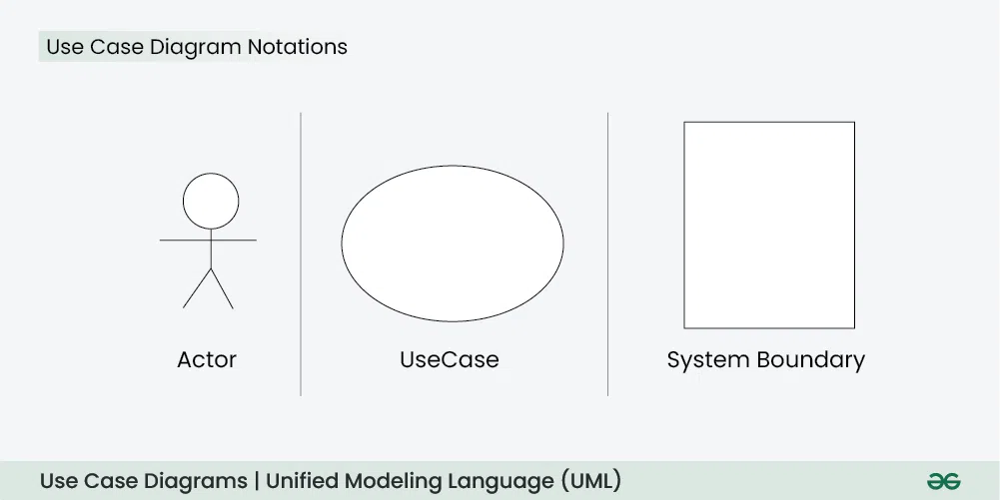
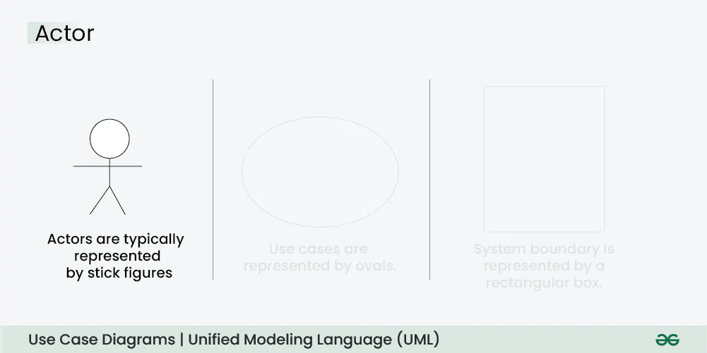
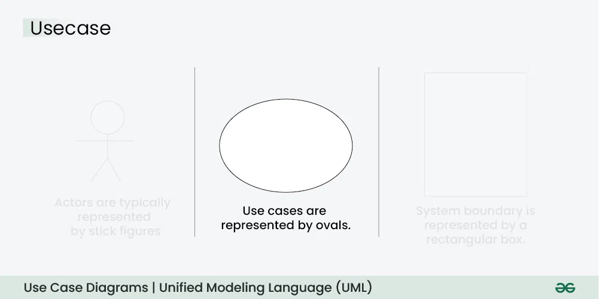
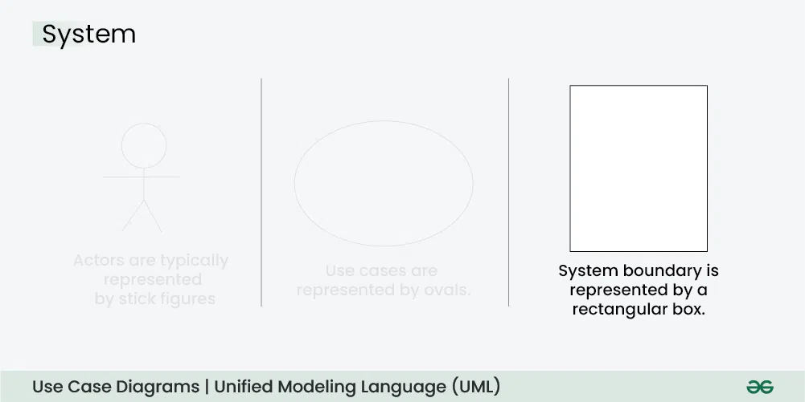
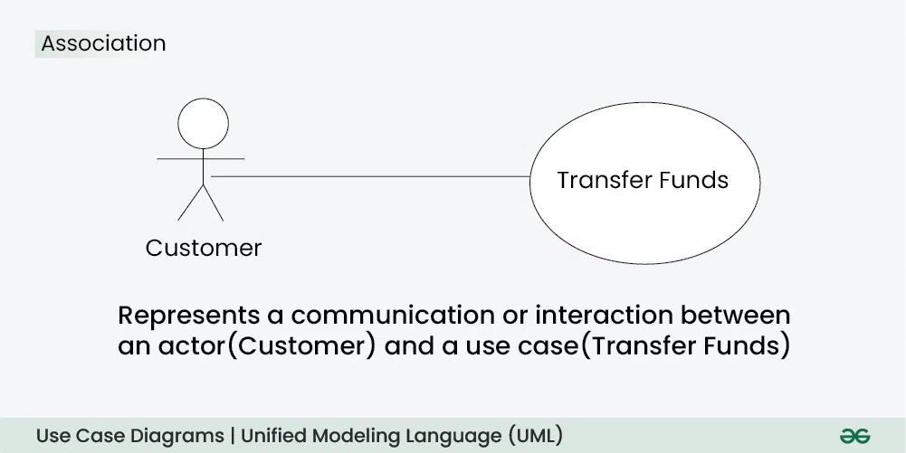
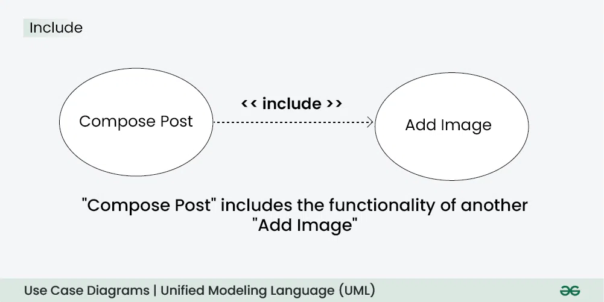
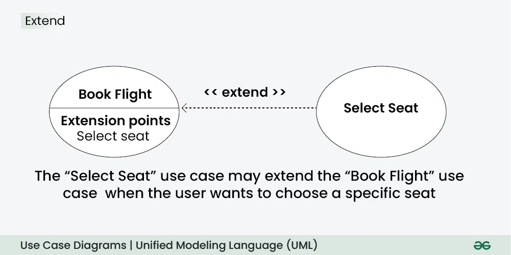
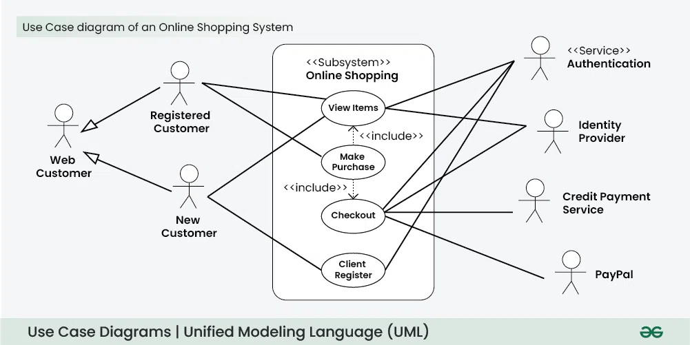

# Use Case Diagram - Unified Modeling Language (UML)
A Use Case Diagram is a visual way to show how users (actors) interact with a system and what functions (use cases) the system provides. It helps understand the system’s behavior from the user’s perspective.

- Represents actors (users or external systems) and use cases (system functionalities).
- Shows the relationships between users and system features.
- Helps define system scope, requirements, and interactions clearly.

## Use Case Diagram in UML

A Use Case Diagram is a type of Unified Modeling Language (UML) diagram that represents the interaction between actors (users or external systems) and a system under consideration to accomplish specific goals. It provides a high-level view of the system's functionality by illustrating the various ways users can interact with it.

## When to apply Use Case Diagram?

Use case diagrams are useful in several situations. Here’s when you should consider using them:

- When you need to gather and clarify user requirements, use case diagrams help visualize how different users interact with the system.
- If you’re working with diverse groups, including non-technical stakeholders, these diagrams provide a clear and simple way to convey system functionality.
- During the system design phase, use case diagrams help outline user interactions and plan features, ensuring that the design aligns with user needs.
- When defining what is included in the system versus what is external, use case diagrams help clarify these boundaries.

## Use Case Diagram Notations

UML notations provide a visual language that enables software developers, designers, and other stakeholders to communicate and document system designs, architectures, and behaviors in a consistent and understandable manner.

### 1. Actors

Actors are external entities that interact with the system. These can include users, other systems, or hardware devices. In the context of a Use Case Diagram, actors initiate use cases and receive the outcomes. Proper identification and understanding of actors are crucial for accurately modeling system behavior.

### 2. Use Cases

Use cases are like scenes in the play. They represent specific things your system can do. In the online shopping system, examples of use cases could be "Place Order," "Track Delivery," or "Update Product Information". Use cases are represented by ovals.

### 3. System Boundary

The system boundary is a visual representation of the scope or limits of the system you are modeling. It defines what is inside the system and what is outside. The boundary helps to establish a clear distinction between the elements that are part of the system and those that are external to it. The system boundary is typically represented by a rectangular box that surrounds all the use cases of the system.

## Use Case Diagram Relationships

In a Use Case Diagram, relationships play a crucial role in depicting the interactions between actors and use cases.

### 1. Association Relationship

The Association Relationship represents a communication or interaction between an actor and a use case. It is depicted by a line connecting the actor to the use case. This relationship signifies that the actor is involved in the functionality described by the use case.

> Example: Online Banking System

Example: Online Banking System

- Actor: Customer
- Use Case: Transfer Funds
- Association: A line connecting the "Customer" actor to the "Transfer Funds" use case, indicating the customer's involvement in the funds transfer process.

### 2. Include Relationship

The Include Relationship indicates that a use case includes the functionality of another use case. It is denoted by a dashed arrow pointing from the including use case to the included use case. This relationship promotes modular and reusable design.

> Example: Social Media Posting

Example: Social Media Posting

- Use Cases: Compose Post, Add Image
- Include Relationship: The "Compose Post" use case includes the functionality of "Add Image." Therefore, composing a post includes the action of adding an image.

### 3. Extend Relationship

The Extend Relationship illustrates that a use case can be extended by another use case under specific conditions. It is represented by a dashed arrow with the keyword "extend." This relationship is useful for handling optional or exceptional behavior.

> Example: Flight Booking System

Example: Flight Booking System

- Use Cases: Book Flight, Select Seat
- Extend Relationship: The "Select Seat" use case may extend the "Book Flight" use case when the user wants to choose a specific seat, but it is an optional step.

### 4. Generalization Relationship

The Generalization Relationship establishes an "is-a" connection between two use cases, indicating that one use case is a specialized version of another. It is represented by an arrow pointing from the specialized use case to the general use case.

> Example: Vehicle Rental System

Example: Vehicle Rental System

- Use Cases: Rent Car, Rent Bike
- Generalization Relationship: Both "Rent Car" and "Rent Bike" are specialized versions of the general use case "Rent Vehicle."

## Draw a Use Case diagram in UML

Below are the main steps to draw use case diagram in UML:

- Step 1: Identify Actors: Determine who or what interacts with the system. These are your actors. They can be users, other systems, or external entities.
- Step 2: Identify Use Cases: Identify the main functionalities or actions the system must perform. These are your use cases. Each use case should represent a specific piece of functionality.
- Step 3: Connect Actors and Use Cases: Draw lines (associations) between actors and the use cases they are involved in. This represents the interactions between actors and the system.
- Step 4: Add System Boundary: Draw a box around the actors and use cases to represent the system boundary. This defines the scope of your system.
- Step 5: Define Relationships: If certain use cases are related or if one use case is an extension of another, you can indicate these relationships with appropriate notations.
- Step 6: Review and Refine: Step back and review your diagram. Ensure that it accurately represents the interactions and relationships in your system. Refine as needed.
- Step 7: Validate: Share your use case diagram with stakeholders and gather feedback. Ensure that it aligns with their understanding of the system's functionality.

## Use Case Diagram example(Online Shopping System)

Let's understand how to draw a Use Case diagram with the help of an Online Shopping System:

- Actors
- Customer

### Use Cases

- Browse Products
- Add to Cart
- Checkout
- Manage Inventory (Admin)

### Relations

- The Customer can browse products, add items to the cart, and complete the checkout.
- The Admin can manage the inventory

Below is the use case diagram of an Online Shopping System:

## Common Use Case Diagram Tools and Platforms

Several tools and platforms are available to create and design Use Case Diagrams. These tools offer features that simplify the diagram creation process, facilitate collaboration among team members, and enhance overall efficiency. Here are some popular Use Case Diagram tools and platforms:

Lucidchart

- Cloud-based collaborative platform
- Real-time collaboration and commenting
- Templates for various diagram types

### draw.io

- Free, open-source diagramming tool
- Works offline and integrates with Google Drive, Dropbox, and others
- Supports a wide range of diagram types, including Use Case Diagrams

### Microsoft Visio

- Part of the Microsoft Office suite
- Supports various diagram types, including Use Case Diagrams
- Extensive shape libraries and templates

### SmartDraw

- User-friendly diagramming tool
- Templates for different diagram types, including Use Case Diagrams
- Integration with Microsoft Office and Google Workspace

### PlantUML

- Open-source tool for creating UML diagrams
- Text-based syntax for diagram specification
- Supports collaborative work using version control systems

## Common Mistakes while making Use Case Diagram

Avoiding common mistakes ensures the accuracy and effectiveness of the Use Case Diagram. Here are key points for each mistake:

- Adding too much detail can confuse people.
- Unclear connections lead to misunderstandings about system interactions.
- Different names for the same elements create confusion.
- Incorrectly using generalization can misrepresent relationships.
- Failing to define the system’s limits makes its scope unclear.
- Treating the diagram as static can make it outdated and inaccurate.

## Best Practices for Use Case Diagram

Crafting clear and effective Use Case Diagrams is essential for conveying system functionality and interactions. Here are some best practices to consider:

- Use Case Diagram focus on capturing the core functions of the system, avoiding extraneous details.
- They uses a uniform naming scheme for use cases and actors throughout the diagram to enhance clarity and prevent misunderstandings.
- They ensure uniformity in the appearance of elements such as ovals (for use cases), stick figures (for actors), and connecting lines to create a polished presentation.
- They help in organizing use cases into coherent groups that represent distinct modules or subsystems within the overall system.
- Use Case Diagrams adopt an iterative method, updating the diagram as the system changes or as new information emerges.

## Purpose and Benefits of Use Case Diagrams

The Use Case Diagram offers numerous benefits throughout the system development process. Here are some key advantages of using Use Case Diagrams:

- Use Case Diagrams offer a clear visual representation of a system’s functions and its interactions with external users. This representation helps stakeholders, including those without technical expertise, in grasping the system’s overall behavior.
- They establish a shared language for articulating system requirements, ensuring that all team members have a common understanding.
- Use Case Diagram illustrate the different ways users engage with the system, contributing to a thorough comprehension of its functionalities.
- In the design phase, Use Case Diagrams help outline how users (actors) will interact with the system. They support the planning of user interfaces and aid in structuring system functionalities.