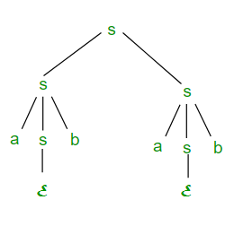

# Ambiguity in Context free Grammar and Languages
Context-Free Grammars (CFGs) are essential in formal language theory and play a crucial role in programming language design, compiler construction, and automata theory. One key challenge in CFGs is ambiguity, which can lead to multiple derivations for the same string.

## Understanding Derivation in Context-Free Grammars

Suppose we have a context free grammar G with production rules:

> S \rightarrow aSb \ | \ bSa \ | \ SS \ | \ \varepsilon

S \rightarrow aSb \ | \ bSa \ | \ SS \ | \ \varepsilon

### 1. Left most derivation (LMD) and Derivation Tree

A leftmost derivation (LMD) is a sequence where the leftmost non-terminal is replaced first at every step.

Example: Leftmost Derivation of "abab"

> S \Rightarrow aSb \Rightarrow abSab \Rightarrow abab

S \Rightarrow aSb \Rightarrow abSab \Rightarrow abab

In this derivation, the underlined symbols indicate replacements based on the production rules.

Derivation tree: It tells how string is derived using production rules from S and has been shown in Figure below.

### 2. Right most derivation (RMD)

A rightmost derivation (RMD) follows the same principle as LMD but replaces the rightmost non-terminal first at each step.

#### Example: Rightmost Derivation of "abab"

> S \Rightarrow SS \Rightarrow SaSb \Rightarrow Sab \Rightarrow aSbab \Rightarrow abab

S \Rightarrow SS \Rightarrow SaSb \Rightarrow Sab \Rightarrow aSbab \Rightarrow abab

Again, the underlined symbols indicate the replaced non-terminals. The derivation tree for RMD is shown in Figure below.

### 3. Comparing LMD and RMD

A derivation can be LMD, RMD, both, or neither.

Example of both LMD and RMD:

> S \Rightarrow aSb \Rightarrow abSab \Rightarrow abab

S \Rightarrow aSb \Rightarrow abSab \Rightarrow abab

Example of only RMD:

> S \Rightarrow SS \Rightarrow SaSb \Rightarrow Sab \Rightarrow aSbab \Rightarrow abab

S \Rightarrow SS \Rightarrow SaSb \Rightarrow Sab \Rightarrow aSbab \Rightarrow abab

## Ambiguity in Context-Free Grammars

A context-free grammar (CFG) is ambiguous if there exists more than one leftmost or rightmost derivation for the same string. As a result, ambiguous grammars lead to multiple derivation trees for a single string.

Example: For the grammar G, the string abab has multiple derivations:

1. Derivation 1 (RMD):

> S \Rightarrow SS \Rightarrow SaSb \Rightarrow Sab \Rightarrow aSbab \Rightarrow abab

S \Rightarrow SS \Rightarrow SaSb \Rightarrow Sab \Rightarrow aSbab \Rightarrow abab

2. Derivation 2 (LMD & RMD):

> S \Rightarrow aSb \Rightarrow abSab \Rightarrow abab

S \Rightarrow aSb \Rightarrow abSab \Rightarrow abab

Since the grammar generates more than one derivation tree for abab, it is ambiguous.

## Ambiguous Context-Free Languages (CFLs)

A context-free language (CFL) is called ambiguous if no unambiguous CFG can describe it. Such languages are also known as inherently ambiguous CFLs.

### Key Observations:

- If a CFG is ambiguous, the corresponding language L(G) may or may not be ambiguous.
- It is not always possible to convert an ambiguous CFG into an unambiguous CFG.
- There exists no general algorithm to convert an ambiguous CFG into an unambiguous CFG.
- Every unambiguous CFL has at least one unambiguous CFG.
- Deterministic CFLs are always unambiguous.

Question:

Consider the following context-free grammar:

G = \{ S \to SS, S \to ab, S \to ba, S \to \varepsilon \}

Which of the following statements about G are true?

I. G is ambiguousII. G generates all strings with an equal number of "a" and "b"III. G can be accepted by a deterministic PDA

Which option correctly identifies the true statements?

A) I onlyB) I and III onlyC) II and III onlyD) I, II, and III

Solution:

Statement I is true: There are multiple leftmost derivations for the string abab, proving that G is ambiguous.Statement II is false: G cannot generate strings like aabb, meaning it does not produce all strings with equal "a" and "b".Statement III is true: G can be accepted by a deterministic PDA.

Correct Answer:

B) I and III only