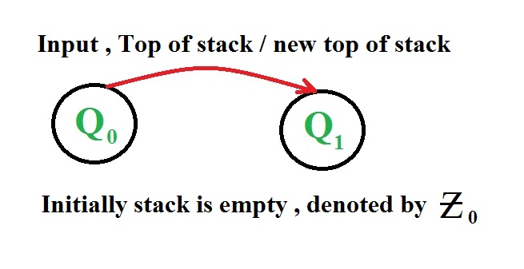
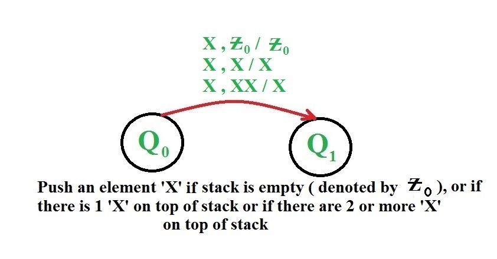
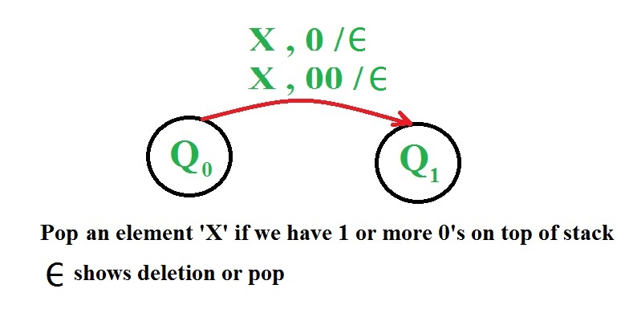
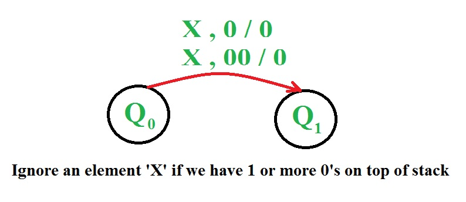
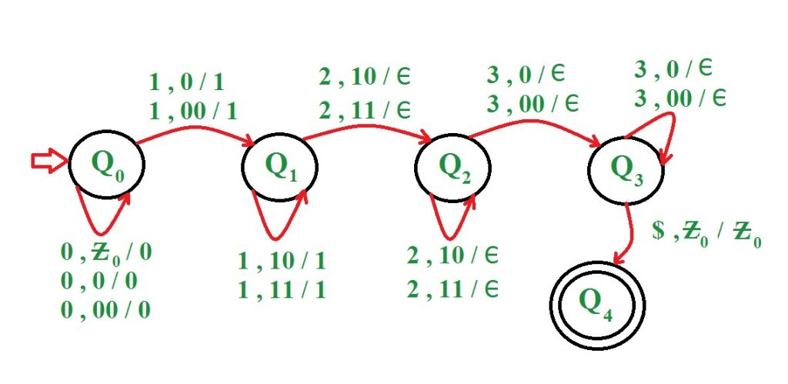
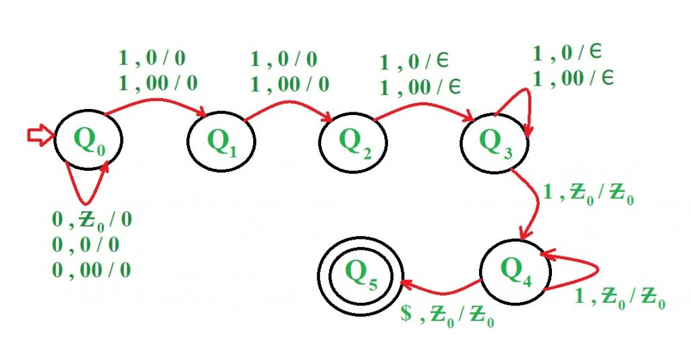

# Construct Pushdown Automata for given languages
Prerequisite - Pushdown Automata, [[pushdown-automata-acceptance-by-final-state|Pushdown Automata Acceptance by Final State]] A push down automata is similar to deterministic finite automata except that it has a few more properties than a DFA.The data structure used for implementing a PDA is stack. A PDA has an output associated with every input. All the inputs are either pushed into a stack or just ignored. User can perform the basic push and pop operations on the stack which is use for PDA. One of the problems associated with DFAs was that could not make a count of number of characters which were given input to the machine. This problem is avoided by PDA as it uses a stack which provides us this facility also. A Pushdown Automata (PDA) can be defined as - M = (Q, Σ, Γ, δ, q0, Ζ, F) where

- Q is a finite set of states
- Σ is a finite set which is called the input alphabet
- Γ is a finite set which is called the stack alphabet
- δ is a finite subset of Q X ( Σ ∪ {ε} X Γ X Q X Γ*) the transition relation.
- q0 ∈ Q is the start state
- Ζ ∈ Γ is the initial stack symbol
- F ⊆ Q is the set of accepting states

Representation of State Transition -



Representation of Push in a PDA -



Representation of Pop in a PDA -



Representation of Ignore in a PDA -



### Q) Construct a PDA for language L = {0n1m2m3n | n>=1, m>=1}

Approach used in this PDA - First 0's are pushed into stack. Then 1's are pushed into stack. Then for every 2 as input a 1 is popped out of stack. If some 2's are still left and top of stack is a 0 then string is not accepted by the PDA. Thereafter if 2's are finished and top of stack is a 0 then for every 3 as input equal number of 0's are popped out of stack. If string is finished and stack is empty then string is accepted by the PDA otherwise not accepted.

- Step-1: On receiving 0 push it onto stack. On receiving 1, push it onto stack and goto next state
- Step-2: On receiving 1 push it onto stack. On receiving 2, pop 1 from stack and goto next state
- Step-3: On receiving 2 pop 1 from stack. If all the 1's have been popped out of stack and now receive 3 then pop a 0 from stack and goto next state
- Step-4: On receiving 3 pop 0 from stack. If input is finished and stack is empty then goto last state and string is accepted



Examples:

```
Input  : 0 0 1 1 1 2 2 2 3 3
Result : ACCEPTED

Input  : 0 0 0 1 1 2 2 2 3 3 
Result : NOT ACCEPTED 
```

### Q) Construct a PDA for language L = {0n1m | n >= 1, m >= 1, m > n+2}

Approach used in this PDA - First 0's are pushed into stack.When 0's are finished, two 1's are ignored. Thereafter for every 1 as input a 0 is popped out of stack. When stack is empty and still some 1's are left then all of them are ignored.

- Step-1: On receiving 0 push it onto stack. On receiving 1, ignore it and goto next state
- Step-2: On receiving 1, ignore it and goto next state
- Step-3: On receiving 1, pop a 0 from top of stack and go to next state
- Step-4: On receiving 1, pop a 0 from top of stack. If stack is empty, on receiving 1 ignore it and goto next state
- Step-5: On receiving 1 ignore it. If input is finished then goto last state



Examples:

```
Input  : 0 0 0 1 1 1 1 1 1
Result : ACCEPTED

Input  : 0 0 0 0 1 1 1 1
Result : NOT ACCEPTED
```