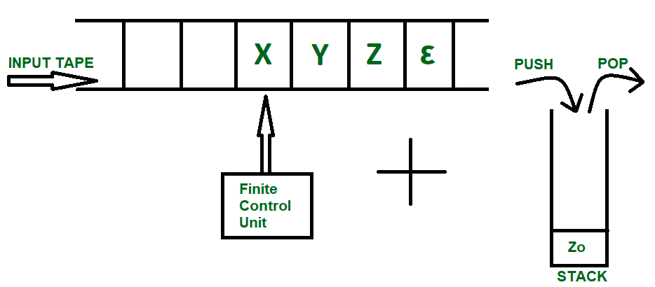
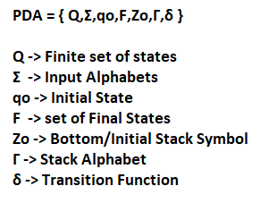
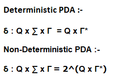
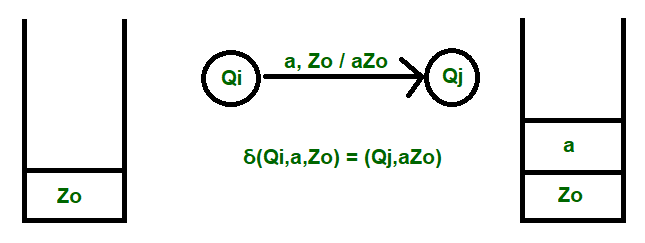
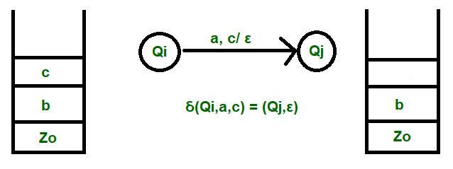
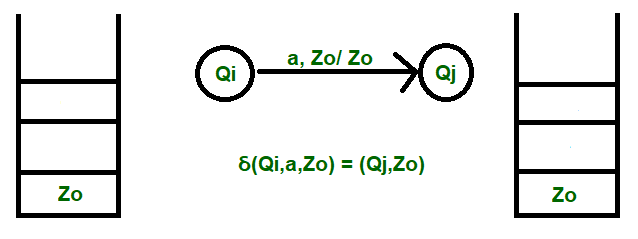

# Detailed Study of PushDown Automata
According to the Chomsky Hierarchy, the requirement of a certain type of grammar to generate a language is often clubbed with a suitable machine that can be used to accept the same language. When the grammar is simple, the language becomes more complex, hence we require a more powerful machine to understand the language and accept it.

Example: Type 0 Grammar generates a Recursive Enumerable Language (REL), which requires "Turing Machine" to accept all strings. Similarly Type 2 Grammar generates Context Free Language accepted by a Push Down Automata (PDA). The diagram above shows a input tape which is how a Finite Automata works, the strings are accepted into the tape and the read header keeps getting updated according the instructions provided by Finite Control Unit. Pushdown Automata on the other hand is a combination of this tape and a [[stack-data-structure|Stack data structure]]. The tuples included to form a PDA are as follows:

We see that the first four tuples Q, $\epsilon , qo and F are similar as in the case of a Finite Automata. Let's talk about $Z_o$ , now that we know that Pushdown Automata has a Stack mechanism to accept languages which aren't possible in a Finite Automata. The problem comes when before a Push operation we need to check for Overflow Condition, or before a Pop Operation we check for the Underflow Condition. We solve this problem by assuming that the Stack is infinite, while the empty condition is overcome by pre introducing an element $Z_o$ into the stack before working on the string.

This assumption helps us in two ways :-

1. We overcome the underflow condition thus saving any memory to keep a check on Stack empty.
2. Initial Stack symbol can be used to declare that string processing has been done successfully.

> NOTE: NPDA is more powerful than DPDA.

NOTE: NPDA is more powerful than DPDA.

Gamma Symbol ( ) is used to denote all the Stack Alphabets. Each input alphabet ( same or different ) can be denoted by a different Stack symbol. It's also necessary as it conveys the topmost element of the stack to the machine. Delta Function ( ) is the transition function, the use of which will become more clear by taking a closer look at the Three Major operations done on Stack:

1. Push
2. Pop
3. Skip

1.PUSH

The transition takes place in the order :- Input, Topmost Element / Final List Here, a is the input element, which is inserted into the stack, thus making the final content to be aZo.

2.POP

The transition takes place in the order :-Input Element, Topmost Element / Removal Confirmation Here, a is the input, c is the element to be deleted and the removal confirmation is shown by Epsilon symbol declaring that the immediate has been popped and is Empty.

3.SKIP

The transition takes place in the order:- Input Element, Topmost element/Topmost Element Here, a is the input and the stack remains unchanged after this operation. Hence, this concludes the detailed study on how a Pushdown Automata works. Next we will be heading onto some examples to make working and transitions more clear.

