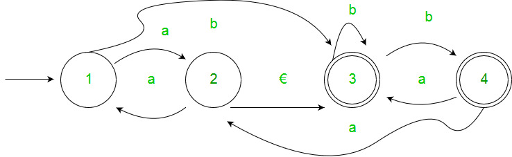
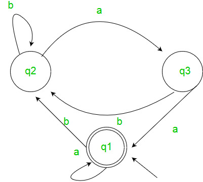

# Generating Regular Expression from Finite Automata
Finite Automata and Regular Expressions are two ways to represent patterns in strings within formal language theory. While Finite Automata use states and transitions, Regular Expressions provide a compact symbolic notation.

Converting a Finite Automaton into a Regular Expression helps to understand their equivalence and is useful in fields like compiler design and text processing.

### 1. State Elimination Method

Step 1: If the initial state is either an accepting state or has incoming transitions, introduce a new non-accepting start state. Then, add an €-transition (epsilon transition) from the new start state to the original start state.

Step 2: If there are multiple accepting states, or if the single accepting state has outgoing transitions, create a new accepting state. Change all other accepting states to non-accepting states. Add €-transitions from each former accepting state to this new accepting state.

Step 3: For each state that is neither a start nor an accepting state, eliminate the state and update the transitions accordingly to maintain the functionality of the automaton.

Example:

Solution:

### 2. Arden’s Theorem

Let P and Q be 2 regular expressions. If P does not contain null string, then the following equation in R, viz R = Q + RP, Has a unique solution by R = QP*

Assumptions -

- The transition diagram should not have €-moves.
- It must have only one initial state.

Using Arden’s Theorem to find Regular Expression of Deterministic Finite automata -

1. For getting the regular expression for the automata we first create equations of the given form for all the states q1 = q1w11 +q2w21 +…+qnwn1 +€ (q1 is the initial state) q2 = q1w12 +q2w22 +…+qnwn2 . . . qn = q1w1n +q2w2n +…+qnwnn wij is the regular expression representing the set of labels of edges from qi to qj Note - For parallel edges there will be that many expressions for that state in the expression.
2. Then we solve these equations to get the equation for qi in terms of wij and that expression is the required solution, where qi is a final state.

Example: Solution: Here the initial state is q1 and the final state is q1. The equations for the three states q1, q2, and q3 are as follows:

We are given the following equations for three states: q1, q2, and q3:

- q1 = q1a + q3a + € (since q1 is the initial state, we have an epsilon transition)
- q2 = q1b + q2b + q3b
- q3 = q2a

Solving the Equations:

Step 1: Solve for q2

- Start by substituting the value of q3 into the equation for q2: q2 = q1b + q2b + q3b
- Substituting q3 = q2a: q2 = q1b + q2b + (q2a)b
- Simplify the expression: q2 = q1b + q2(b + ab)

Now, apply Arden's Theorem to simplify further: q2 = q1b (b + ab)*

Step 2: Solve for q1

- Now substitute the value of q2 into the equation for q1: q1 = q1a + q3a + €
- Substitute q3 = q2a: q1 = q1a + q2aa + €
- Substitute the value of q2 = q1b(b + ab)*: q1 = q1a + q1b(b + ab)*aa + €
- Simplify the expression: q1 = q1(a + b(b + ab)*aa) + €
- Finally, apply Arden's Theorem: q1 = (a + b(b + ab)*aa)*

Hence, the regular expression is (a + b(b + ab)*aa)*.

GATE CS Corner Questions Practicing the following questions will help you [[test]] your knowledge. All questions have been asked in GATE in previous years or in GATE Mock Tests. It is highly recommended that you practice them.

1. GATE CS 2008, Question 52
2. GATE CS 2007, Question 74
3. GATE CS 2014 (Set-1), Question 25
4. GATE CS 2014 (Set-1), Question 65
5. GATE IT 2006, Question 5
6. GATE CS 2013, Question 33
7. GATE CS 2012, Question 12