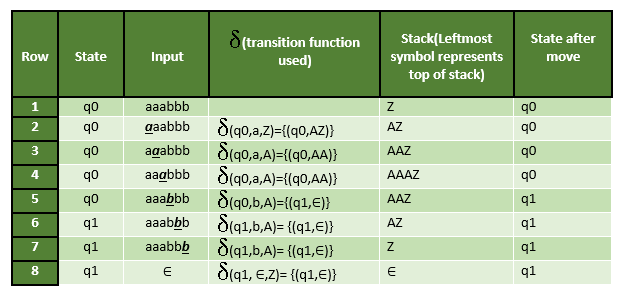
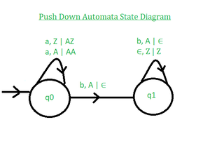

# Introduction of Pushdown Automata
A pushdown automaton is a finite automaton equipped with an extra memory structure called a stack. The stack works on the Last-In-First-Out (LIFO) principle and enables pushdown automata to recognize Context-Free Languages (CFLs). This article describes pushdown automata in detail.

A Pushdown Automaton (PDA) is formally defined as a 7-tuple:

PDA = (Q, Σ, Γ, δ, q₀, Z, F)

where:

- Q is the finite set of states
- Σ is the set of input symbols
- Γ is the set of pushdown (stack) symbols
- q₀ is the initial state
- Z is the initial stack symbol present in the stack
- F is the set of final states
- δ is the transition function that mapsQ × (Σ ∪ {ε}) × Γ → Q × Γ*

In each transition, the PDA reads an input symbol (or ε) and the symbol at the top of the stack, moves to a new state, and updates the stack by pushing or popping symbols.

## Instantaneous Description (ID)

Instantaneous Description (ID) is an informal notation of how a PDA “computes” an input string and makes a decision whether that string is accepted or rejected.

An ID is a triple (q, w, α), where: 1. q is the current state. 2. w is the remaining input. 3.α is the stack contents, top at the left.

## Turnstile Notation

⊢ sign is called a “turnstile notation” and represents one move. ⊢* sign represents a sequence of moves. E.g.- (p, b, T) ⊢ (q, w, α) This implies that while taking a transition from state p to state q, the input symbol ‘b’ is consumed, and the top of the stack ‘T’ is replaced by a new string 'α' Example : Define the pushdown automata for language {anbn | n > 0} Solution : M = where Q = { q0, q1 } and Σ = { a, b } and Γ = { A, Z } and δ is given by : δ( q0, a, Z ) = { ( q0, AZ ) } δ( q0, a, A) = { ( q0, AA ) } δ( q0, b, A) = { ( q1, ∈) } δ( q1, b, A) = { ( q1, ∈) } δ( q1, ∈, Z) = { ( q1, ∈) } Let us see how this automata works for aaabbb.

Explanation : Initially, the PDA is in state q0 with Z on the stack and input aaabbb. For each input ‘a’, it stays in q0 and pushes A onto the stack, resulting in AAAZ after three a’s. On reading the first ‘b’, it pops A and moves to q1. For each remaining ‘b’, one A is popped. After all b’s are read, the stack contains only Z. Finally, on ε input, Z is popped, making the stack empty. Hence, the string is accepted by empty stack acceptance.

Push Down Automata State Diagram:

Note :

- The above pushdown automaton is deterministic in nature because there is only one move from a state on an input symbol and stack symbol.
- The non-deterministic pushdown automata can have more than one move from a state on an input symbol and stack symbol.
- It is not always possible to convert non-deterministic pushdown automata to deterministic pushdown automata.
- The expressive power of non-deterministic PDA is more as compared to expressive deterministic PDA as some languages are accepted by NPDA but not by deterministic PDA which will be discussed in the next article.
- The pushdown automata can either be implemented using acceptance by empty stack or acceptance by final state and one can be converted to another.

Question: Which of the following pairs have DIFFERENT expressive power?

A. Deterministic finite automata(DFA) and Non-deterministic finite automata(NFA) B. Deterministic push down automata(DPDA)and Non-deterministic push down automata(NPDA) C. Deterministic single-tape Turing machine and Non-deterministic single-tape Turing machine D. Single-tape Turing machine and the multi-tape Turing machine Solution : Every NFA can be converted into DFA. So, there expressive power is same. As discussed above, every NPDA can’t be converted to DPDA. So, the power of NPDA and DPDA is not the same. Hence option (B) is correct.