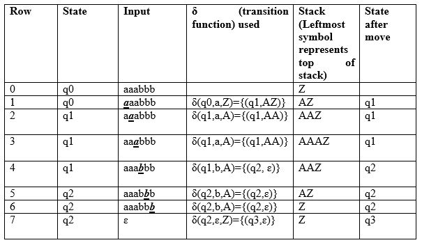
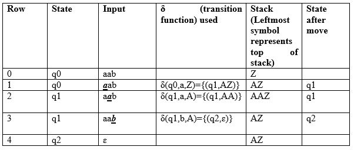
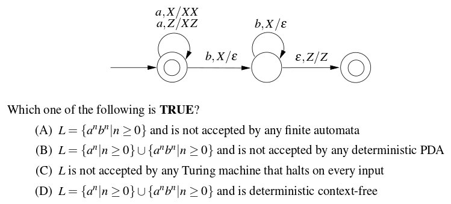
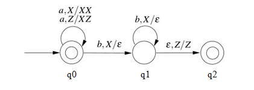

# Pushdown Automata Acceptance by Final State
We have discussed Pushdown Automata (PDA) and its acceptance by empty stack article. Now, in this article, we will discuss how PDA can accept a CFL based on the final state. Given a PDA P as:

```
P = (Q, Σ, Γ, δ, q0, Z, F)
```

The language accepted by P is the set of all strings consuming which PDA can move from initial state to final state irrespective of any symbol left on the stack which can be depicted as:

```
L(P) = {w |(q0, w, Z) =>(qf, ɛ, s)}
```

Here, from start state q0 and stack symbol Z, the final state qf ɛ F is reached when input w is consumed. The stack can contain a string s which is irrelevant as the final state is reached and w will be accepted.

Example: Define the pushdown automata for language {a^nb^n | n > 0} using final state.

Solution: M = where Q = {q0, q1, q2, q3} and ∑ = {a, b} and Γ = { A, Z } and F={q3} and δ is given by:

```
δ( q0, a, Z ) = { ( q1, AZ ) }
δ( q1, a, A) = { ( q1, AA ) }
δ( q1, b, A) = { ( q2, ɛ) }
δ( q2, b, A) = { ( q2, ɛ) }
δ( q2, ɛ, Z) = { ( q3, Z) }
```

Let us see how this automaton works for aaabbb:



The automaton starts in state q₀ with stack symbol Z and input aaabbb. For each a, it pushes A onto the stack and moves to q₁. For each b, it pops A and moves to q₂. After all input is read, the stack contains Z. On ε input with Z, the automaton moves to final state q₃, so the string is accepted by final state acceptance.



As we can see in row 4, the input has been processed and PDA is in state q2 which is a non-final state, the string aab will not be accepted. Let us discuss the question based on this:

Que-1. Consider the transition diagram of a PDA given below with input alphabet ∑ = {a, b}and stack alphabet Γ = {X, Z}. Z is the initial stack symbol. Let L denote the language accepted by the PDA. (GATE-CS-2016)



Solution: We first label the state of the given PDA as:



Next, the given PDA P can be written as:

```
Q = {q0, q1, q2} and ∑ = {a, b} 
And Γ = {X, Z} and F={q0,q2} and δ is given by :
δ( q0, a, Z ) = {( q0, XZ)}
δ( q0, a, X) = {( q0, XX )}
δ( q0, b, X) = {( q1, ɛ)}
δ( q1, b, X) = {( q1, ɛ)}
δ( q1, ɛ, Z) = {( q2, Z)}
```

As we can see, q0 is the initial as well as the final state, ɛ will be accepted. For every a, X is pushed onto the stack and PDA remains in the final state. Therefore, any number of a’s can be accepted by PDA. If the input contains b, X is popped from the stack for every b. Then PDA is moved to the final state if the stack becomes empty after processing input (δ( q1, ɛ, Z) = {( q2, Z)}). Therefore, a number of b must be equal to the number of an if they exist. As there is only one move for a given state and input, the PDA is deterministic. So, the correct option is (D).