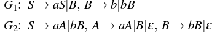
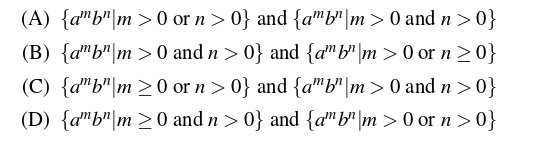
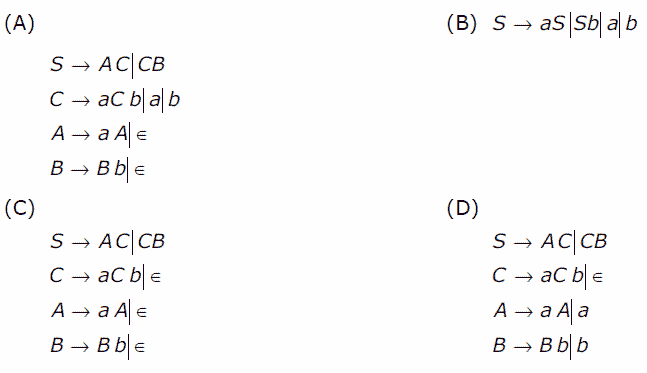

# Relationship between grammar and language in Theory of Computation
Theory of Computation treats grammar and language as core ideas for describing and solving computational problems. A grammar consists of a set of production rules that define how strings can be formed, while a language is the collection of all valid strings generated by those rules. Understanding the relationship between grammar and language is essential for areas such as programming language design, parser construction, and automata theory.

- A language is a set of strings formed over a given alphabet.
- Each string in a language follows specific syntactic rules.
- Languages can be classified as regular, context-free, context-sensitive, or recursively enumerable.
- Languages are used to model valid inputs, commands, and programs in computation.

## Language generated by a grammar

Given a grammar G, its corresponding language L(G) represents the set of all strings generated from G. Consider the following grammar,

> G: S-> aSb|ε

G: S-> aSb|ε

Here, using S-> ε, we can generate ε. Therefore, ε is part of L(G). Similarly, using S=>aSb=>ab, ab is generated. Similarly, aabb can also be generated. Therefore,

> L(G) = {anbn, n>=0}

L(G) = {anbn, n>=0}

In language L(G) discussed above, the condition n = 0 is taken to accept ε.

Key Points -

- For a given grammar G, its corresponding language L(G) is unique.
- The language L(G) corresponding to grammar G must contain all strings which can be generated from G.
- The language L(G) corresponding to grammar G must not contain any string which can not be generated from G.

### Example Questions

### Que-1: Consider the grammar: (GATE-CS-2009)

S -> aSa | bSb | a | b

The language generated by the above grammar over the alphabet {a, b} is the set of:

(A) All palindromes(B) All odd-length palindromes(C) Strings that begin and end with the same symbol(D) All even-length palindromes

Solution:Using S -> a and S -> b, we can generate 'a' and 'b'. Similarly, using S => aSa => aba, the string 'aba' is generated. Other strings generated from the grammar include:{ a, b, aba, bab, aaa, bbb, ababa, ... }Thus, the correct answer is (B) All odd-length palindromes.

### Que-2: Consider the following context-free grammars: (GATE-CS-2016)

Which one of the following pairs of languages is generated by G1 and G2, respectively?

Solution:Consider the grammar G1: Using S=>B=>b, b can be generated. Using S=>B=>bB, bb can be generated. Using S=>aS=>aB=>ab can be generated. Using S=>aS=>aB=>abB=>abb can be generated. As we can see, number of a’s can be zero or more but number of b is always greater than zero. Therefore,

> L(G1) = {ambn| m>=0 and n>0}

L(G1) = {ambn| m>=0 and n>0}

Consider the grammar G2: Using S=>aA=>a, a can be generated. Using S=>bB=>b, b can be generated. Using S=>aA=>aaA=>aa can be generated. Using S=>bB=>bbB=>bb can be generated. Using S=>aA=>aB=>abB=>abb can be generated. As we can see, either a or b must be greater than 0. Therefore,

> L(G2) = {ambn| m>0 or n>0}

L(G2) = {ambn| m>0 or n>0}

## Grammar generating a given language

Given a language L(G), its corresponding grammar G represents the production rules which produces L(G). Consider the language L(G):

> L(G) = {anbn, n>=0}

L(G) = {anbn, n>=0}

The language L(G) is set of strings ε, ab, aabb, aaabbb…. For ε string in L(G), the production rule can be S->ε. For other strings in L(G), the production rule can be S->aSb|ε. Therefore, grammar G corresponding to L(G) is:

> S->aSb| ε

S->aSb| ε

Key Points -

- For a given language L(G), there can be more than one grammar which can produce L(G).
- The grammar G corresponding to language L(G) must generate all possible strings of L(G).
- The grammar G corresponding to language L(G) must not generate any string which is not part of L(G).

| Grammar | Language |
| --- | --- |
| A set of production rules that describes how strings are formed | A set of strings generated using those rules |
| Provides the structure and syntax of strings | Represents the final output strings following that structure |
| Usually denoted as G = (V, Σ, P, S) | Denoted as L(G), the language generated by grammar G |
| Defines how strings can be generated | Contains all valid strings that can be generated |
| Belongs to the rule-defining side of computation | Belongs to the set-theoretic side of computation |
| Multiple forms can generate the same result | May be generated by multiple rule systems |
| Used in parsing and syntax analysis | Used for acceptance and recognition by automata |
| Classified using the Chomsky hierarchy (Type-0 to Type-3) | Classified using the Chomsky hierarchy (RE, CSL, CFL, RL) |

Let us discuss questions based on this:

### Que-3. Which one of the following grammar generates the language L = {ai b j | i≠j}? (GATE-CS-2006)

Solution:

The given language L contains the strings :

> {a, b, aa, bb, aaa, bbb, aab, abb…}

{a, b, aa, bb, aaa, bbb, aab, abb…}

It means either the string must contain one or more number of a OR one or more number of b OR a followed by b having unequal number of a and b. If we consider grammar in option (A), it can generate ab as:

> S=>AC=>aAC=>aC=>ab

S=>AC=>aAC=>aC=>ab

However, ab can’t be generated by language L. Therefore, grammar in option (A) is not correct. Similarly, grammar in option (B) can generate ab as:

> S=>aS=>ab

S=>aS=>ab

However, ab can’t be generated by language L. Therefore, grammar in option (B) is not correct. Similarly, grammar in option (C) can generate ab as:

> S=>AC=>C=>aCb=>ab

S=>AC=>C=>aCb=>ab

However, ab can’t be generated by language L. Therefore, grammar in option (C) is not correct. Therefore, using method of elimination, option (D) is correct.