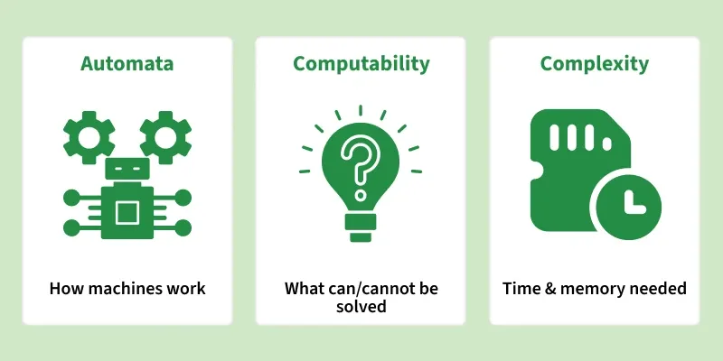

# Theory of Computation Tutorial
Theory of Computation (TOC) is the part of computer science that studies which problems computers can solve, how they solve them, and how efficiently they can do it.

- Studies simple abstract machines and helps design compilers and language processors.
- Identifies which problems can or cannot be solved by a computer.
- Analyses the time and memory needed to solve problems and compares their efficiency.
- It provides a foundation for understanding the limits and capabilities of computers and helps us explore the fundamental principles of computation.

### Why We Need Theory of Computation:

- Understand the limits of what computers can solve.
- Design faster and more efficient algorithms and programs.
- Building a strong foundation in programming and algorithms, making coding easier to understand.
- Improve the performance and reliability of computing systems.

> Example: TOC can help a computer check if a password is correct or not. This shows how it solves problems step by step.

Example: TOC can help a computer check if a password is correct or not. This shows how it solves problems step by step.

## Introduction

Explains different types of abstract machines, and explores their role in modelling and analysing computational processes, problem-solving, and pattern recognition.

- [[Basics|Introduction]]
- [[grammar-in-theory-of-computation|Grammar in Theory of Computation]]
- Chomsky Hierarchy
- [[applications-of-various-automata|Applications of various Automata]]

## Finite Automata

Automata theory and formal languages, highlighting their significance in modelling computational behaviour, analysing problem-solving processes, and understanding the limits of computation.

- Finite Automata [[Basics|Introduction]]
- Minimization of DFA
- Operations on DFA
- NFA to DFA Conversion
- [[problems-on-finite-automata|Problems on Finite Automata]]

## Regular Expressions, Grammar & Language

Highlighting how they work together in pattern recognition and language processing.

- Regular Expressions, Grammar & Languages
- Designing Finite Automata from Regular Expressions
- Arden’s Theorem
- L-graphs and what they represent
- Hypothesis (language regularity) and algorithm (L-graph to NFA)
- How to identify if a language is regular or not
- [[star-height-of-regular-expression-and-regular-language|Star Height of Regular Expression and Regular Language]]
- [[generating-regular-expression-from-finite-automata|Generating regular expression from finite automata]]
- Kleene’s Theorem Part-1
- MEALY and MOORE Machines
- Mealy vs Moore Machine

>> Quiz on Regular Languages and Finite Automata

## CFG (Context Free Grammar)

This section focuses on grammars that describe nested structures and generate context-free languages, which are essential for defining programming language syntax and structure.

- Relationship between grammar and language
- [[simplifying-context-free-grammars|Simplifying Context Free Grammars]]
- [[closure-properties-of-context-free-languages|Closure Properties of Context Free Languages]](CFL)
- Union & Intersection of Regular languages with CFL
- [[converting-context-free-grammar-to-chomsky-normal-form|Converting Context Free Grammar to Chomsky Normal Form]]
- [[converting-context-free-grammar-to-greibach-normal-form|Converting Context Free Grammar to Greibach Normal Form]]
- Pumping Lemma
- [[check-if-the-language-is-context-free-or-not|Check if the language is Context Free or Not]]
- Ambiguity in Context Free Grammar
- [[operator-grammar-and-precedence-parser|Operator grammar and precedence parser]]
- Context-sensitive Grammar (CSG) and Language (CSL)

## PDA (Pushdown Automata)

Explains automata equipped with stack-based memory, used for recognizing context-free languages and for modeling recursive and nested computational structures.

- Pushdown Automata
- [[pushdown-automata-acceptance-by-final-state|Pushdown Automata Acceptance by Final State]]
- [[detailed-study-of-pushdown-automata|Detailed Study of Pushdown Automata]]
- [[problems-on-pushdown-automata|Problems on Pushdown Automata]]

>> Quiz on Context Free Languages and Pushdown Automata

## Turing Machine

This section studies the Turing Machine model, which represents the theoretical foundation of general-purpose computation and helps in understanding the limits and power of algorithmic problem solving.

- Turing Machine
- Halting Problem
- Theory of Computation | [[applications-of-various-automata|Applications of various Automata]]
- [[turing-machine-as-comparator|Turing Machine as Comparator]]
- [[problems-on-turing-machine|Problems on Turing Machine]]

>> Quiz on Turing Machines and Recursively Enumerable Sets

## Decidability

Decidable and undecidable problems. This section explains which problems can be solved using algorithms, which problems cannot be solved at all, and how computational problems are classified into different categories based on their time and space complexity.

- Decidability
- Undecidability and Reducibility
- NP-Completeness | Set 1 ([[Basics|Introduction]])
- Proof that Hamiltonian Path is NP-Complete
- Proof that vertex cover is NP complete
- Computable and non-computable problems

>> Quiz on Undecidability

## Quick Links

- Last Minute Notes(LMNs)
- ‘Quizzes’ on Theory Of Computation !
- Recent Articles on Theory Of Computation