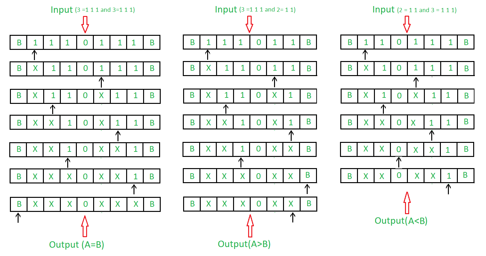

# Turing Machine as Comparator
Problem : Draw a Turing machine which compare two numbers. Using unary format to represent the number. For example, 4 is represented by

```
4 = 1 1 1 1  or 0 0 0 0 
```

Lets use one's for representation. Example:



Approach:

1. Comparing two numbers by comparing number of '1's.
2. Comparing '1's by marking them 'X'.
3. If '1's are remaining in left of '0', then first number is greater.
4. If '1's are remaining in right of '0', then second number is greater.
5. If both '1' are finished then both numbers are equal.

Steps:

- Step-1: Convert 1 into X and move right and goto step 2. If symbol is 0 ignore it and move right and go to step-6.
- Step-2: Keep ignoring 1 and move towards right. Ignore 0 move right and go to step-3.
- Step-3: Keep ignoring X and move towards right. Ignore 1 move left and go to step-4. If B is found ignore it and move left and goto step-9.
- Step-4: Keep ignoring X and move towards left. Ignore 0 move left and go to step-5.
- Step-5: Keep ignoring 1 and move towards left. Ignore X move right and go to step-1.
- Step-6: Keep ignoring X and move towards right. If B is found ignore it and move left and go to step-8. If 1 is found ignore it and move right and goto step-7.
- Step-7: Stop the Machine (A < B)
- Step-8: Stop the Machine (A > B)
- Step-9: Stop the Machine (A = B)

State transition diagram :

- Comparator for A < B
- Comparator for A = B
- Comparator for A > B
- Universal Comparator for A < B, A = B, A > B


Here, Q0 shows the initial state and Q2, Q3, Q4, Q5 shows the transition state and (A < B), (A = B)and (A > B) shows the final state. 0, 1 are the variables used and R, L shows right and left. Explanation:

- Using Q0, when 1 is found make it X and go to leftand to state Q1. and if 0 found move to right to Q5 state.
- On the state Q1, ignore all 1 and goto right.If 0 found ignore it and goto right into next state Q2.
- In Q2, ignore all X and move right.If B found stop the execution and you will goto the state showing A > B, If 1 found make it X move left and to Q3.
- In Q3 state, ignore all X and move left.If 0 found ignore it move left to Q4.
- In Q4, ignore all 1 and move left.If X found ignore it move right.
- In Q5 state, ignore all X and move right.If 1 found ignore it move right and stop the machine it will give the result that A < B.And if, B found move left to stop the machine it will give the result that A = B