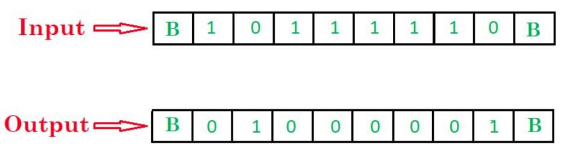
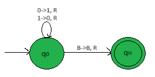
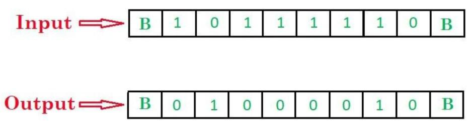
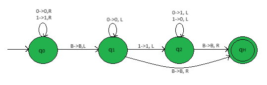

# Turing machine for 1's and 2’s complement
## Problem-1:

#### Draw a Turing machine to find 1's complement of a binary number.

#### 1’s complement of a binary number is another binary number obtained by toggling all bits in it, i.e., transforming the 0 bit to 1 and the 1 bit to 0.

### Example:

### Approach:

1. Scanning input string from left to right
2. Converting 1's into 0's
3. Converting 0's into 1's
4. Stop when you reach the end of the string (when BLANK is encountered)

### States:

- q0: Initial state
- qH: Final state

### Symbols:

- 0, 1: Binary digits
- B: Blank symbol
- R, L: Right and left movements

### Steps:

- Step-1. Convert all 0's into 1's and all 1's into 0's and if B is found go to right.
- Step-2. Stop the machine.

### Turing Machine:

### Explanation:

- State q0 replaces '1' with '0' and '0' with '1' and moves to the right.
- When BLANK is reached, move towards the right and reach the final state qH.

## Problem-2:

#### Draw a Turing machine to find 2's complement of a binary number.

#### 2’s complement of a binary number is 1 added to the 1’s complement of the binary number.

### Example:

### Approach:

1. Start from the end of the input string.
2. Pass all consecutive '0's.
3. When you encounter the first '1', do nothing.
4. After that, replace '1' with '0' and '0' with '1'.
5. Stop when you reach the beginning of the string.

### Intuition:

Whenever a number's 1's complement is taken and 1 bit is added to its LSB (Least Significant Bit), all the 1's (which were originally 0) appearing together from right will add with the carry and change back to 0. Since the first encounter of 0 in 1's complement string (which was originally 1) , every '1' bit to its right, if any, will add 1 and change to 0. The first encountered 0 in the string will add 1 and change back to 1, as in the original string. This does not impact any further bit to its left, thus final string have

1. All 0's same to the right of first '1' bit encountered ( ( complement of 0) + 1) = 0 + carry(=1) to its left element)
2. The first '1' bit encountered will also revert back to 1 the same way.
3. All other bits to its left will be flipped without any restrictions.

### States:

- q0: Initial state
- q1, q2: Transition states
- qH: Final state

### Symbols:

- 0, 1: Binary digits
- B: Blank symbol
- R, L: Right and left movements

### Steps:

- In state q0, move right until you encounter a BLANK symbol. Then, transition to state q1 and go to left.
- In state q1, continue moving left until you encounter the first '1'. Transition to state q2.
- In state q1, if BLANK symbol is encountered, then transition to state qH.
- In state q2, replace '1' with '0' and '0' with '1'.
- If BLANK symbol is encountered, then transition to state qH.
- In state qH, halt the machine.

### Turing Machine

### Explanation:

- Using state 'q0' we reach the end of the string.
- When BLANK is reached, move towards the left.
- Using state 'q1' we pass all 0's and move left till first '1' is found.
- If before finding '1' we encounter BLANK, it implies the number is 0 i.e. it contains no 1.
- Hence its 2s complement is 0 itself. So no need to change any symbols and just halt the machine.
- If '1' is encountered, skip that '1' and move left.
- Using state 'q2' we complement the each digit and move left.
- When BLANK is reached, move towards the right and reach the final state qH.