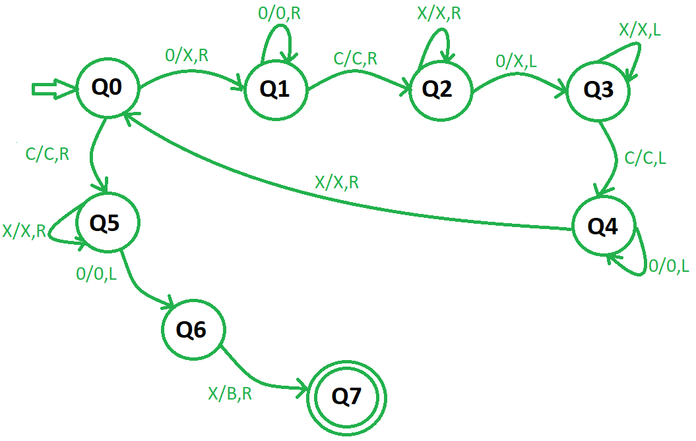

# Turing Machine for subtraction | Set 2
Prerequisite – Turing Machine, [[turing-machine-for-subtraction-set-1|Turing machine for subtraction | Set 1]] A number is represented in binary format in different finite automatas like 5 is represented as (101) but in case of subtraction Turing Machine unary format is followed . In unary format a number is represented by either all ones or all zeros. For example, 5 will be represented by a sequence of five ones 5 = 1 1 1 1 1 or 0 0 0 0 0. Lets use zeros for representation. For subtraction of numbers using a Turing Machine, both these numbers are given as input to the Turing machine separated by a “c”. Example – (3 – 4) or (4 – 3) will be given as 0 0 0 c 0 0 0 0

```
Input:  0 0 0 c 0 0 0 0  // (3 - 4) or (4 - 3)
Output:  0              // (1)
```

Approach used – Convert a 0 in the first number into X and then move to the right, keep ignoring 0’s and “c” then make the first 0 as X and move to the left . Now keep ignoring 0’s, X’s and “c” and after finding the second zero repeat the same procedure till all the zeros on the left hand side becomes X .Now move right and convert the last X encountered into B(Blank). Steps – Step 1 – Convert 0 into X and move right then goto step2 . If symbol is “c” then ignore it with moving to the right and go to step 6 . Step 2 – Keep ignoring 0’s and move right . Ignore “c”, move right and goto step 3 . Step 3 – Keep ignoring X and move right . Convert the first 0 encountered as X and move left and goto step 4 . Step 4 – Keep ignoring all X’s and “c” to the left and goto step 5 . Step 5 – Keep moving left with ignoring 0’s and when the first X is found then ignore it and move right, and goto step 1 . Step 6 – Keep ignoring all the X’s and move to the right . Ignore the first 0 encountered and move to the left then goto step 7 . Step 7 – Convert the X into B ( Blank ) and goto step 8 . Step 8 – End .

