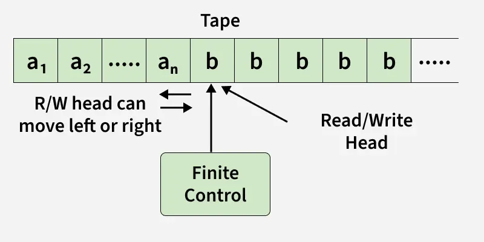
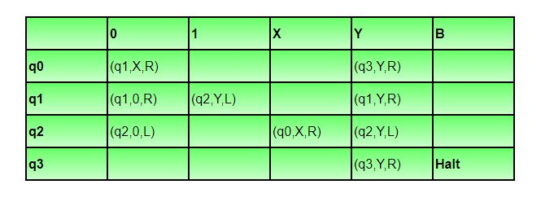
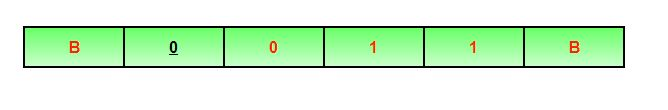
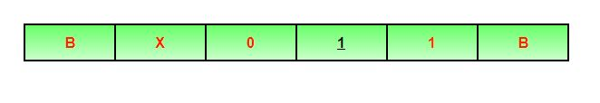
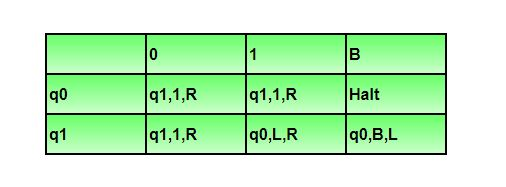
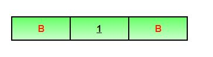
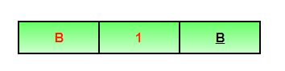
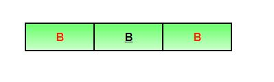

# Turing Machine in TOC
Turing Machines (TM) play a crucial role in the Theory of Computation (TOC). They are abstract computational devices used to explore the limits of what can be computed. Turing Machines help prove that certain languages and problems have no algorithmic solution. Their simplicity makes them an effective tool for studying computational theory, yet they are as powerful as modern computers.

- A Turing Machine (TM) has an infinite tape, a read/write head, and rules that control how it reads, writes, and moves on the tape. It can simulate any computation, making it as powerful as modern computers.
- The behavior of a TM is controlled by a finite state machine consisting of a finite set of states, a transition function, and start and accept states.
- The machine starts in the initial state and follows transition rules until it reaches an accept or reject state.
- In automata theory, Turing Machines are used to study algorithms, computability, and computational complexity.

Why Turing Machines ?

While one might consider using programming languages like C to study computation, Turing Machines are preferred because:

- They are simpler to analyze.
- They provide a clear, mathematical model of computation.
- They possess infinite memory, making them even more powerful than real-world computers.

A Turing Machine consists of a tape of infinite length on which read and writes operation can be performed. The tape consists of infinite cells on which each cell either contains input symbol or a special symbol called blank. It also consists of a head pointer which points to cell currently being read and it can move in both directions.

### Turing Machine Formalism

A Turing Machine is defined by:

1. A finite set of states (Q).
2. An input alphabet (Σ).
3. A tape alphabet (Γ) that includes Σ.
4. A transition function (δ).
5. A start state (q0).
6. A blank symbol (B).
7. A set of final states (F).

### Example: Turing Machine

We construct a Turing Machine (TM) for the language L = {0ⁿ1ⁿ | n ≥ 1}, which accepts strings of equal 0s followed by equal 1s.

Components:

- Q = {q₀, q₁, q₂, q₃} (q₀ is the initial state)
- T = {0,1,X,Y,B} (B represents blank, X and Y mark processed symbols)
- Σ = {0,1} (input symbols)
- F = {q₃} (final state)

Transition Table:

Illustration

Let us see how this turing machine works for 0011. Initially head points to 0 which is underlined and state is q0 as:

The move will be δ(q0, 0) = (q1, X, R). It means, it will go to state q1, replace 0 by X and head will move to right as:

The move will be δ(q1, 0) = (q1, 0, R) which means it will remain in same state and without changing any symbol, it will move to right as:

The move will be δ(q1, 1) = (q2, Y, L) which means it will move to q2 state and changing 1 to Y, it will move to left as:

Working on it in the same way, the machine will reach state q3 and head will point to B as shown:

Using move δ(q3, B) = halt, it will stop and accepted. Note:

- In non-deterministic turing machine, there can be more than one possible move for a given state and tape symbol, but non-deterministic TM does not add any power.
- Every non-deterministic TM can be converted into deterministic TM.
- In multi-tape turing machine, there can be more than one tape and corresponding head pointers, but it does not add any power to turing machine.
- Every multi-tape TM can be converted into single tape TM.

Question: A single tape Turing Machine M has two states q0 and q1, of which q0 is the starting state. The tape alphabet of M is {0, 1, B} and its input alphabet is {0, 1}. The symbol B is the blank symbol used to indicate end of an input string. The transition function of M is described in the following table.

The table is interpreted as illustrated below. The entry (q1, 1, R) in row q0 and column 1 signifies that if M is in state q0 and reads 1 on the current tape square, then it writes 1 on the same tape square, moves its tape head one position to the right and transitions to state q1. Which of the following statements is true about M?

1. M does not halt on any string in (0 + 1)+
2. M does not halt on any string in (00 + 1)*
3. M halts on all string ending in a 0
4. M halts on all string ending in a 1

Solution: Let us see whether machine halts on string ‘1’. Initially state will be q0, head will point to 1 as:

Using δ(q0, 1) = (q1, 1, R), it will move to state q1 and head will move to right as:

Using δ(q1, B) = (q0, B, L), it will move to state q0 and head will move to left as:

It will run in the same way again and again and not halt. Option D says M halts on all string ending with 1, but it is not halting for 1. So, option D is incorrect. Let us see whether machine halts on string ‘0’. Initially state will be q0, head will point to 1 as:

Using δ(q0, 0) = (q1, 1, R), it will move to state q1 and head will move to right as:

Using δ(q1,B)=(q0,B,L), it will move to state q0 and head will move to left as:

It will run in the same way again and again and not halt. Option C says M halts on all string ending with 0, but it is not halting for 0. So, option C is incorrect. Option B says that TM does not halt for any string (00 + 1)*. But NULL string is a part of (00 + 1)* and TM will halt for NULL string. For NULL string, tape will be,

Using δ(q0, B) = halt, TM will halt. As TM is halting for NULL, this option is also incorrect. So, option (A) is correct.