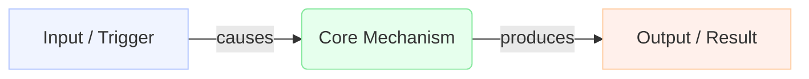

# Wiki Page Templates

> Copy the relevant template when creating a new page.

---

## Template 1 — Concept Page

````markdown
---
concept: Human-Readable Concept Name
aliases: [alternate name, acronym]
tags: [domain-tag, subtopic]
created: YYYY-MM-DD
updated: YYYY-MM-DD
---

## Formal Definition

_A precise, textbook-style definition. Formal and rigorous — as it would appear in a reference textbook or academic paper. If the concept has a standard mathematical or technical definition, state it here._

> [!example] Example (TCP)
> "The Transmission Control Protocol (TCP) is a connection-oriented transport protocol that provides reliable, ordered, and error-checked delivery of a byte stream between applications running on hosts communicating over an IP network."

## Explanation

_Plain language intuition. What does this concept mean in simpler terms? Why does it exist? What problem does it solve? 2–4 sentences accessible to someone unfamiliar with the topic._

## How It Works

_Mechanism step by step. Not just what it does — how it accomplishes it. Bullet points or numbered steps, 4–8 items._

## Mathematical Formulation

_If this concept involves mathematics, use LaTeX. Otherwise delete this section._

$$ \text{equation} $$

_Explain what each term means._

> [!example] Example (congestion window evolution in TCP)
> $$ \text{cwnd} = \begin{cases} \text{cwnd} + 1 & \text{per RTT (slow start)} \\ \text{cwnd} \times 2 & \text{per ACK (congestion avoidance)} \\ \text{cwnd} \gets \frac{\text{cwnd}}{2} & \text{on loss (multiplicative decrease)} \end{cases} $$

## Visual Explanation

_A Mermaid flowchart or diagram showing the concept's architecture, flow, or structure. Use this INSTEAD of LaTeX for non-mathematical visualizations._



_Replace labels with vocabulary from this concept. Use graph TD for hierarchies, graph LR for flows. 4–8 nodes._

## Mental Model & Analogy

_A real-world analogy that makes the concept instantly click. How would you explain this to a smart 10-year-old? (Feynman Technique)_

> [!example] Example (Queue)
> "Think of a queue like a line of people waiting at a grocery store checkout. The first person in line is the first one served (FIFO)."

## Implementation & Examples

_Practical usage. If this is a CS concept, provide a core code snippet (C++/Python). If it's DevOps, provide a config or CLI command. Keep it minimal and focused on the core mechanism._


## Key Properties

- Property one: explanation
- Property two: explanation
- Property three: explanation

## Connections

- **Built from:** [[prerequisite-page|Prerequisite Name]] — one line on why
- **Builds into:** [[higher-concept|Higher Concept]] — one line on how this enables it
- **Contrasts with:** [[other-approach|Other Approach]] — one line on the key difference
- **Related:** [[adjacent-concept|Adjacent Concept]] — one line on the relationship

_(Minimum 4 connections. Be specific — explain the relationship, don't just list names.)_

## Edge Cases & Gotchas

- Where this concept breaks down or is misapplied
- Common misconceptions
- Boundary conditions

## Active Recall Questions

_2-3 thought-provoking questions to test retention. Hide the answers using Obsidian collapsible callouts so you can test yourself later without spoiling the answer._

> [!question]- What happens if...?
> _Answer goes here._

## Sources

- [[topic-name-summary|Source: Full Title]] — what this source contributed
````

---

## Template 2 — Synthesis Page

```markdown
---
title: A vs B — Descriptive Title of the Comparison
type: synthesis
tags: [domain-tag, subtopic]
created: YYYY-MM-DD
updated: YYYY-MM-DD
---

## What's Being Compared

_One paragraph framing the comparison. Why does this distinction matter? What problem does understanding the difference solve?_

## Core Tension

_What is the fundamental tradeoff or design decision that separates A from B? This is the insight, not just the list of differences._

## Comparison Table

| Dimension | [[page-a\|A]] | [[page-b\|B]] |
|-----------|--------------|--------------|
| When to use | ... | ... |
| Performance | ... | ... |
| Complexity | ... | ... |
| Key limitation | ... | ... |

## When to Choose A

_Specific conditions that favor A. Tied to real use cases._

## When to Choose B

_Specific conditions that favor B._

## The Insight

_What does this comparison reveal that neither page alone captures?_
```

---

## Template 3 — Source Summary

```markdown
---
source: Full Title of the Source
source_path: sources/filename.ext
ingested: YYYY-MM-DD
concepts_count: N
---

## What This Source Is

_One paragraph: what kind of source is this, what topic does it cover, what is its scope?_

## Concepts Extracted

**Created:**

- [[concept-one|Concept One]] — one line on what it covers
- [[concept-two|Concept Two]] — one line on what it covers

**Updated:**

- [[existing-page|Existing Page]] — what new information was merged in

## Syntheses Created

- [[a-vs-b|A vs B]] — what comparison this source prompted

## Key Takeaways

- The most important ideas from this source, in your own words
- 3–6 bullet points

## Open Questions

_(Things this source raised but didn't answer — also append these to wiki/open-questions.md)_

- Question one?
- Question two?
```

---

## Template 4 — Map of Content (MOC)

```markdown
---
title: [Topic Name] — Map of Content
type: moc
tags: [domain-tag, topic]
created: YYYY-MM-DD
updated: YYYY-MM-DD
---

## What This Topic Is About

_2–3 sentences orienting a reader who is new to this topic area._

## Core Concepts

_(The foundational pages — start here)_

- [[concept-a|Concept A]] — one-line summary
- [[concept-b|Concept B]] — one-line summary

## Mechanisms & How Things Work

_(Pages that explain processes, flows, or implementations)_

- [[concept-c|Concept C]] — one-line summary

## Comparisons & Tradeoffs

_(Synthesis pages)_

- [[a-vs-b|A vs B]] — what the comparison is about

## Sources Ingested

- [[topic-summary|Source Title]] — ingested YYYY-MM-DD

## Suggested Reading Order

1. [[concept-a|Concept A]] — start here
2. [[concept-b|Concept B]] — then this
3. [[a-vs-b|A vs B]] — then the comparison
```

---

## Template 5 — Stub Page

_(Created by lint pass when a linked page doesn't exist yet)_

```markdown
---
concept: Concept Name
tags: [domain-tag]
status: stub
created: YYYY-MM-DD
updated: YYYY-MM-DD
---

<!-- Stub created by lint pass. Needs content. -->

## Formal Definition

_To be written._

## Explanation

_To be written._

## Connections

_To be written._
```

---

## Rendering Rules

1. **Mathematics:** Use LaTeX inline (`$x^2$`) or display (`$$...$$`). Never use images for math.
2. **Non-math diagrams:** Use Mermaid ` ```mermaid ` blocks. Never use ASCII art or Graphviz.
3. **Code:** Use ` ``` ` with language tag for code blocks.
4. **Links:** Use Obsidian wiki links `[[page-name|Display Name]]`.
5. **Bidirectional linking:** If page A links to page B, page B must link back to page A.

---

## Section Order (Enforced)

Every concept page must have sections in this exact order:

1. Frontmatter
2. Formal Definition
3. Explanation
4. Mental Model & Analogy
5. How It Works
6. Mathematical Formulation _(optional — delete if no math)_
7. Visual Explanation
8. Implementation & Examples
9. Key Properties
10. Connections
11. Edge Cases & Gotchas
12. Active Recall Questions
13. Sources

Do not reorder. Do not rename. Do not skip required sections.
