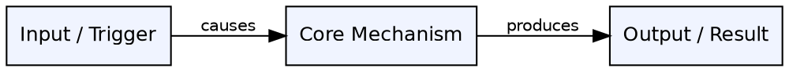
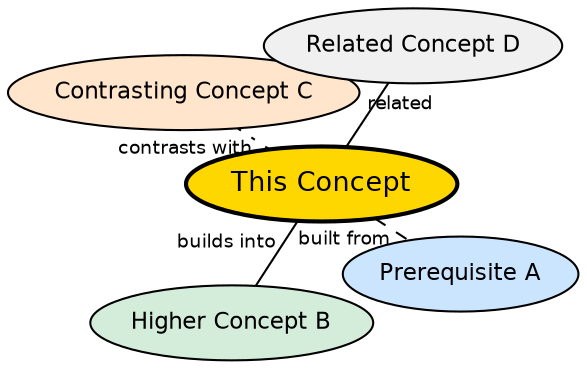

# Wiki Page Templates

> Copy the relevant template when creating a new page.
> Required fields are marked. Optional fields are marked (optional).

---

## Template 1 — Concept Page

````markdown
---
concept: Human-Readable Concept Name
aliases: [alternate name, acronym, misspelling]
tags: [domain-tag, subtopic]
created: YYYY-MM-DD
updated: YYYY-MM-DD
---

## The Problem

_Why does this concept exist? What pain, limitation, or question does it address?
Write 2–4 sentences. This section must not be skipped — it is the "why" that makes everything else stick._

## Core Idea

_The minimum viable definition. What is this concept, in plain language?
One clear paragraph. Avoid jargon where possible._

## How It Works

_The mechanism. Not just what it does, but how it does it.
Step-by-step or cause-and-effect prose. Flesh this out when not a stub._

## Visual Explanation

_A Graphviz DOT diagram showing the concept's internal structure, flow, or mechanism._
_Render with: `dot -Tsvg` or Obsidian's Graphviz plugin._


````

_Replace node labels and edges with vocabulary from this concept.
Use rankdir=TB for top-down hierarchies. 4–8 nodes is the sweet spot._

## Semantic Network

_A Graphviz DOT mind map showing where this concept lives in the knowledge graph._
_Color legend: gold = this concept, blue = prerequisites, green = builds into, orange = contrasts with, gray = related._



_Every node must link to a real wiki page or a planned stub.
Replace labels with actual concept names from your wiki._

## Key Properties

- Property one: explanation
- Property two: explanation
- Property three: explanation

_(Add more as needed. Each bullet should be a specific, falsifiable claim.)_

## Connections

- **Built from:** [[prerequisite-page|Prerequisite Name]] — one line on why
- **Builds into:** [[higher-concept|Higher Concept]] — one line on how this enables it
- **Contrasts with:** [[other-approach|Other Approach]] — one line on the key difference
- **Related:** [[adjacent-concept|Adjacent Concept]] — one line on the relationship

_(Minimum 2 connections. 4+ preferred. Be specific — explain the relationship, don't just list names.)_

## Edge Cases & Gotchas

- Where this concept breaks down or is misapplied
- Common misconceptions
- Boundary conditions

_(Leave as stub note if unknown on first pass.)_

## Sources

- [[topic-name-summary|Source: Full Title]] — what this source contributed

````

---

## Template 2 — Synthesis Page

```markdown
---
title: A vs B — Descriptive Title of the Comparison
type: synthesis
tags: [domain-tag, subtopic]
status: draft
created: YYYY-MM-DD
updated: YYYY-MM-DD
---

## What's Being Compared

*One paragraph framing the comparison. Why does this distinction matter?
What problem does understanding the difference solve?*

## The Core Tension

*What is the fundamental tradeoff or design decision that separates A from B?
This is the insight, not just the list of differences.*

## Comparison

| Dimension | [[page-a\|A]] | [[page-b\|B]] |
|-----------|--------------|--------------|
| When to use | ... | ... |
| Performance | ... | ... |
| Complexity | ... | ... |
| Key limitation | ... | ... |

*(Add or remove rows to fit the concepts being compared.)*

## When to Choose A

*Specific conditions that favor A. Not generic — tied to real use cases from the source.*

## When to Choose B

*Specific conditions that favor B.*

## The Insight

*What does this comparison reveal that neither page alone captures?
This section is what makes a synthesis page worth having.*

## Connections

- [[page-a|Concept A]] — left side of this comparison
- [[page-b|Concept B]] — right side of this comparison
- [[related-synthesis|Related Synthesis]] — if applicable
````

---

## Template 3 — Source Summary

```markdown
---
source: Full Title of the Source
source_path: sources/filename.ext
ingested: YYYY-MM-DD
concepts_count: N
---

## What This Source Is

_One paragraph: what kind of source is this, what topic does it cover, what is its scope?_

## Concepts Extracted

_(List every page created or updated from this source)_

**Created:**

- [[concept-one|Concept One]] — one line on what it covers
- [[concept-two|Concept Two]] — one line on what it covers

**Updated:**

- [[existing-page|Existing Page]] — what new information was merged in

## Syntheses Created

- [[a-vs-b|A vs B]] — what comparison this source prompted

## Key Takeaways

- The most important ideas from this source, in your own words
- 3–6 bullet points

## Open Questions

_(Things this source raised but didn't answer — also append these to `wiki/open-questions.md`)_

- Question one?
- Question two?
```

---

## Template 4 — Map of Content (MOC)

```markdown
---
title: [Topic Name] — Map of Content
type: moc
tags: [domain-tag, topic]
created: YYYY-MM-DD
updated: YYYY-MM-DD
---

## What This Topic Is About

_2–3 sentences orienting a reader who is new to this topic area._

## Core Concepts

_(The foundational pages — start here)_

- [[concept-a|Concept A]] — one-line summary
- [[concept-b|Concept B]] — one-line summary

## Mechanisms & How Things Work

_(Pages that explain processes, flows, or implementations)_

- [[concept-c|Concept C]] — one-line summary

## Comparisons & Tradeoffs

_(Synthesis pages)_

- [[a-vs-b|A vs B]] — what the comparison is about

## Sources Ingested

- [[topic-summary|Source Title]] — ingested YYYY-MM-DD

## Suggested Reading Order

1. [[concept-a|Concept A]] — start here
2. [[concept-b|Concept B]] — then this
3. [[a-vs-b|A vs B]] — then the comparison
```

---

## Template 5 — Stub Page

_(Created by lint pass when a linked page doesn't exist yet)_

```markdown
---
concept: Concept Name
tags: [domain-tag]
status: stub
created: YYYY-MM-DD
updated: YYYY-MM-DD
---

<!-- Stub created by lint pass. Needs content. -->

## The Problem

_To be written._

## Core Idea

_To be written._

## Connections

_To be written._
```
