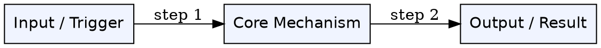

# Ingest Rules

> Loaded by the agent when ingesting a new source.
> Also read `wiki/SCHEMA.md` before creating any pages.

---

## Pre-Ingest Checklist

Before writing a single file:

1. Read the source from `sources/[filename]`
2. Read `wiki/index.md` to see what already exists — avoid duplicates
3. Determine the topic folder name from the source filename (kebab-case, no extension)
4. Check if `wiki/[topic]/` already exists — if yes, add to it, don't create a parallel folder

---

## Step-by-Step Process

### Step 1 — Concept Extraction

Read the source and identify atomic concepts. An atomic concept is a distinct idea, mechanism, pattern, or principle that can stand alone as a page.

**Target: 18-20 concepts per source.** This is a quality target, not a quota.

- If the source genuinely contains more, extract more
- If the source is thin, stop at what's actually there — do not pad or invent subdivisions to hit a number
- Each concept should be something a reader would search for independently

Write your concept list as scratch notes before creating any files. This prevents mid-ingest rethinking.

### Step 2 — Create the Topic Folder

```
wiki/[topic]/
```

If it already exists, skip this step.

### Step 3 — Create Concept Pages

For each concept in your list:

1. Check `wiki/index.md` — does a page for this concept already exist anywhere?
   - **If YES**: open that page, merge new information in, update `updated:` date, increment `sources_count:`
   - **If NO**: create `wiki/[topic]/concept-name.md` using the Concept Page template from `SCHEMA.md`

**Deferred linking rule:** Add outbound `[[links]]` freely. Do NOT go back to other files to add backlinks during ingest — this is expensive and error-prone. Instead, mark where a backlink is needed with a comment on the same line:

```markdown
- **Related:** [[packet-switching|Packet Switching]] <!-- TODO: add backlink here -->
```

These are resolved in the next lint pass.

### Step 4 — Create Synthesis Pages

After concepts are written, look for natural comparisons or tensions in the source material. Create one or more synthesis pages (`wiki/[topic]/a-vs-b.md`) for:

- Two mechanisms that solve the same problem differently
- A concept that evolved from an older one
- A tradeoff that the source explicitly discusses

Use the Synthesis Page template from `SCHEMA.md`. Aim for 1–3 synthesis pages per source, not one per concept pair.

### Step 5 — Create Source Summary

Create `wiki/[topic]/topic-name-summary.md` using the Source Summary template from `SCHEMA.md`.

The summary must list:

- Every concept page created or updated
- Every synthesis page created
- Open questions raised by this source → also append these to `wiki/open-questions.md`

### Step 6 — Create or Update the Map of Content

If `wiki/[topic]/topic-moc.md` does not exist, create it using the MOC template from `SCHEMA.md`.

If it exists, add the new pages to the relevant section.

### Step 7 — Update `wiki/index.md`

Append new rows to the index table. Do not rewrite existing rows unless you updated a page.

```markdown
| [[concept-name\|Display Name]] | topic | one-line summary | status |
```

### Step 8 — Append to `wiki/log.md`

```markdown
## [YYYY-MM-DD] ingest | [Source Title]

- Created: [count] pages in wiki/[topic]/
- Updated: [list any pre-existing pages touched]
- Deferred backlinks: [count] (resolve in next lint)
- Open questions added: [count]
```

---

## Page Quality Bar

A page is **valid** if it has:

- YAML frontmatter (all required fields)
- "The Problem" section — non-empty
- "Core Idea" section — non-empty
- "Visual Explanation" section — Graphviz DOT diagram (required, see below)
- "Semantic Network" section — Graphviz DOT mind map (required, see below)
- "Connections" section — minimum 2 links (4+ preferred, but 2 is the hard floor)

Sections that can be brief stubs on first pass (fill in during lint):

- "How It Works"
- "Key Properties"
- "Edge Cases & Gotchas"

A page is a **stub** if it is missing any required section. Set `status: stub` in frontmatter.

---

## Required Diagrams

Every concept page must contain TWO Graphviz diagrams.

### Diagram 1 — Visual Explanation

Explains the concept's internal structure, flow, or mechanism. Shows HOW it works.



Rules:

- Use `rankdir=LR` for flows, `rankdir=TB` for hierarchies
- Label every edge with its relationship
- 4–8 nodes is the sweet spot — more gets unreadable
- Node labels should be the concept's own vocabulary, not generic placeholders

### Diagram 2 — Semantic Network (Mind Map)

Shows WHERE this concept lives in the knowledge graph — its neighbors, dependencies, and contrasts. This is for memory and navigation, not mechanism explanation.

```dot
graph semantic_[concept_name] {
  layout=neato
  node [shape=ellipse style=filled fontname="Helvetica"]

  // Center node — this concept
  THIS [label="This Concept" fillcolor="#ffd700" fontsize=14]

  // Prerequisites (blue)
  PRE1 [label="Prerequisite A" fillcolor="#cce5ff"]
  PRE2 [label="Prerequisite B" fillcolor="#cce5ff"]

  // Builds into (green)
  OUT1 [label="Builds Into X" fillcolor="#d4edda"]

  // Contrasts with (orange)
  CON1 [label="Contrasts: Y" fillcolor="#ffe5cc"]

  // Related (light gray)
  REL1 [label="Related: Z" fillcolor="#f0f0f0"]

  THIS -- PRE1 [label="built from" style=dashed]
  THIS -- PRE2 [label="built from" style=dashed]
  THIS -- OUT1 [label="builds into"]
  THIS -- CON1 [label="contrasts with" style=dotted]
  THIS -- REL1 [label="related"]
}
```

Rules:

- The concept being defined is always the center node, colored gold (`#ffd700`)
- Use color to encode relationship type (see legend above)
- Use `layout=neato` for organic radial layout
- Every node in this diagram must correspond to a real wiki page or a planned stub
- 5–10 surrounding nodes is ideal

---

## Frontmatter Reference

### Concept page

```yaml
---
concept: Human-Readable Concept Name
aliases: [alt name, acronym, common misspelling]
tags: [domain-tag, subtopic]
status: stub | draft | complete
confidence: high | medium | low | contested
sources_count: 1
last_source: source-filename
created: YYYY-MM-DD
updated: YYYY-MM-DD
---
```

### Synthesis page

```yaml
---
title: A vs B — What Makes Them Different
type: synthesis
tags: [domain-tag, subtopic]
status: stub | draft | complete
created: YYYY-MM-DD
updated: YYYY-MM-DD
---
```

### Source summary

```yaml
---
source: Full Title of Source
source_path: sources/filename.ext
content_hash: (optional, for change detection)
ingested: YYYY-MM-DD
concepts_count: N
---
```
