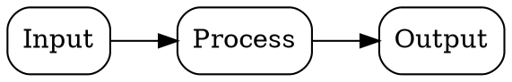
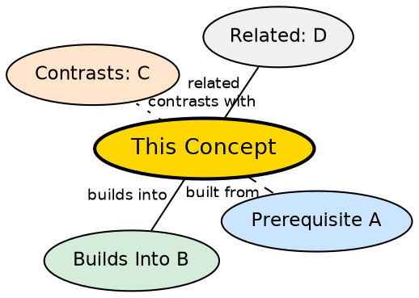

# SCHEMA — Wiki Conventions

> This file defines page formats, naming rules, and linking conventions. Read this before creating any wiki page.

---

## Directory Structure

```
content/
├── sources/                     ← RAW SOURCES (drop anything here — articles, transcripts, papers)
│                                ← Human owns this. LLM reads only, NEVER writes.
│
├── Private/                      ← PERSONAL NOTES (study notes, daily journals, etc.)
│   ├── Daily/
│   ├── computer-networks/
│   ├── django/
│   └── ...
│
└── wiki/                        ← THE WIKI (LLM-owned, interlinked, compounding)
    ├── SCHEMA.md                ← THIS file
    ├── index.md                 ← Wiki landing page (catalog with one-line summaries)
    ├── log.md                   ← Append-only, grep-parseable log
    ├── MAINTENANCE.md           ← Human's maintenance guide
    │
    ├── ejb/                     ← Topic folder (one per ingested source)
    │   ├── stateless-session-bean.md      ← concept page
    │   ├── activation.md                  ← concept page
    │   ├── cmp-vs-bmp.md                  ← synthesis page
    │   └── ejb-summary.md                 ← source summary
    │
    ├── networking/              ← Another topic folder
    │   ├── packet-switching.md
    │   └── ...
    │
    └── theory-of-computation/   ← Another topic folder
        ├── turing-machine.md
        └── ...
```

**Raw Sources** = `sources/` (anything you drop: articles, transcripts, papers, notes) + existing topic folders in `Private/` (`Private/computer-networks/`, etc.). These are **immutable** — the LLM **reads from them but never modifies them**. They are the source of truth.

**The Wiki** = `wiki/` directory. The LLM **owns this entirely**. It creates pages, updates them, maintains cross-references, and keeps everything consistent. The human reads it; the LLM writes it.

**Topic Folders** = Inside `wiki/`, each ingested source gets its own folder named after the source (human-readable, kebab-case). ALL pages from that source — concepts, syntheses, source summaries — live inside this single folder.

---

## Topic Folder Naming Rule

When ingesting a source, create a topic folder named after the source:

| Source File | Topic Folder |
|---|---|
| `Ejb.md` | `wiki/ejb/` |
| `karpathy-transformer-inference.md` | `wiki/karpathy-transformer-inference/` |
| `django-orm-deep-dive.md` | `wiki/django-orm-deep-dive/` |
| `computer-networks-intro.md` | `wiki/computer-networks-intro/` |

Rules:
- Use the source filename without extension, converted to kebab-case
- If multiple sources cover the same topic, add them to the SAME folder
- If the folder already exists, add new pages to it — don't create a duplicate folder
- Keep it short but descriptive — `ejb` not `ejb-source-from-my-2025-semester-notes`

---

## Page Types

### 1. Concept Pages
- **Location:** `wiki/[topic-folder]/[concept-name].md`
- **One atomic concept per file**
- **Frontmatter:**
```yaml
---
concept: Human Readable Concept Name
aliases: [alias1, alias2]
tags: [domain, subdomain]
sources_count: 1
last_source: source-filename.md
created: YYYY-MM-DD
updated: YYYY-MM-DD
---
```

**Maturity tracking:**
- `sources_count` — how many distinct sources have contributed to this concept (starts at 1)
- `last_source` — which source last updated this concept (for tracking provenance)
- A concept with `sources_count >= 3` is considered **well-established**
- A concept with `sources_count == 1` is **fragile** — needs more sources to confirm it

### 2. Synthesis Pages
- **Location:** `wiki/[topic-folder]/[comparison-name].md`
- **Comparisons, deep dives, analyses spanning multiple concepts**
- **Frontmatter:**
```yaml
---
title: Human Readable Title
type: comparison | deep-dive | analysis
tags: [domain, subdomain]
created: YYYY-MM-DD
updated: YYYY-MM-DD
---
```

### 3. Source Summaries
- **Location:** `wiki/[topic-folder]/[topic-name]-summary.md`
- **What the LLM extracted from each source**
- **Frontmatter:**
```yaml
---
source: Human Readable Source Name
source_path: sources/filename.md
content_hash: sha256hash
ingested: YYYY-MM-DD
concepts_count: N
---
```

**Dedup:** `content_hash` is the SHA-256 of the source file. If a new source has the same hash as an existing one, skip it — it's the same content under a different name.

---

## Domain Tags

The FIRST tag must ALWAYS be a domain tag. Use ONLY these:

| Domain Tag | Covers |
|---|---|
| `networking` | Computer networks, protocols, communication |
| `ai` | AI, knowledge representation, reasoning |
| `ml` | Machine learning, deep learning, training, inference |
| `systems` | Distributed systems, microservices, architecture |
| `dev` | Software engineering, frameworks, tools, EJB, Spring |
| `theory` | Theory of computation, formal languages, automata |
| `database` | Data storage, querying, consistency |
| `security` | Encryption, auth, vulnerabilities |
| `meta` | Concepts about learning, knowledge, thinking |

Second tag = specific subdomain:

```yaml
tags: [dev, ejb]              ← good
tags: [dev, ejb, persistence]  ← also fine, 3 tags max
tags: [ejb, session-bean]     ← WRONG — "ejb" is not a domain
tags: [dev]                    ← acceptable but prefer 2 tags
tags: [theory, automata]       ← good
tags: [networking, switching]  ← good
```

---

## Concept Page Template

Every concept page MUST follow this exact section structure and order:

```markdown
---
concept: Concept Name
aliases: [alias1, alias2]
tags: [domain, subdomain]
created: YYYY-MM-DD
updated: YYYY-MM-DD
---

## Formal Definition

_A precise, textbook-style definition. Formal and rigorous — as it would appear in a reference textbook. State any standard mathematical or technical definition here._

> Example: "TCP is a connection-oriented transport protocol that provides reliable, ordered, and error-checked delivery of a byte stream between applications running on hosts communicating over an IP network."

## Explanation

_Plain language intuition. What does this concept mean in simpler terms? Why does it exist? What problem does it solve? 2–4 sentences._

## How It Works

_Mechanism step by step. Not just what it does — how it accomplishes it. 4–8 bullet points or numbered steps._

## Mathematical Formulation

_If this concept involves mathematics, use LaTeX. Otherwise delete this entire section._

$$ \text{equation} $$

_Explain each term._

## Visual Explanation

_A Graphviz DOT diagram showing the concept's architecture, flow, or structure._



## Semantic Network

_A Graphviz DOT mind map showing where this concept lives in the knowledge graph. Color legend: gold = this concept, blue = prerequisites, green = builds into, orange = contrasts with, gray = related._



Every node must link to a real wiki page or planned stub. 5–10 surrounding nodes.

## Key Properties

- Property 1: brief explanation
- Property 2: brief explanation
- Property 3: brief explanation

## Connections

- Built from: [[concept-filename|Display Name]] — how this concept depends on it
- Builds into: [[concept-filename|Display Name]] — what uses this concept
- Contrasts with: [[concept-filename|Display Name]] — how they differ
- Related: [[concept-filename|Display Name]] — adjacent idea

Minimum 4 connections. Each must have a brief explanation of the relationship.

## Edge Cases & Gotchas

- When does this fail or break down?
- What hidden assumptions does it rely on?
- What do people commonly misunderstand about it?

## Sources

- [[../topic-name-summary|Human readable source name]]
```

---

## Rendering Rules

1. **Mathematics:** Use LaTeX inline (`$x^2$`) or display (`$$...$$`). Never use images for math.
2. **Non-math diagrams:** Use Graphviz ` ```dot ` blocks. Never use ASCII art or Mermaid.
3. **Code:** Use ` ``` ` with language tag for code blocks.
4. **Links:** Use Obsidian wiki links `[[page-name|Display Name]]`.
5. **Bidirectional linking:** If page A links to page B, page B must link back to page A.

---

## Section Order (Enforced)

Every concept page must have sections in this exact order:

1. Frontmatter
2. Formal Definition
3. Explanation
4. How It Works
5. Mathematical Formulation _(optional — delete if no math)_
6. Visual Explanation
7. Semantic Network
8. Key Properties
9. Connections
10. Edge Cases & Gotchas
11. Sources

Do not reorder. Do not rename. Do not skip required sections.

---

## Cross-Reference Strategy

Every concept should link to:
1. **Prerequisites** — concepts it builds upon (Built from)
2. **Applications** — concepts that use it (Builds into)
3. **Contrasts** — similar but different concepts (Contrasts with)
4. **Relations** — adjacent or related concepts (Related)

The goal is a **dense graph**, not a tree. Concepts should have 4+ connections minimum.

### Link format
Use Obsidian wiki links: `[[filename-without-ext|Display Name]]`

Obsidian resolves links across all topic folders automatically.

### Bidirectional linking is mandatory
If page A links to page B, page B must mention page A in its Connections section.

---

## What NOT To Do

- Do NOT modify anything in `sources/` (human's raw sources, LLM only reads)
- Do NOT modify files outside `wiki/` (existing study notes are immutable)
- Do NOT create concept pages without checking if one already exists
- Do NOT leave broken wiki links
- Do NOT write vague Connections sections — be specific about the relationship
- Do NOT create catch-all pages — split concepts into atomic pages
- Do NOT skip the "Formal Definition" section — every concept needs its precise definition first
- Do NOT use non-domain tags as the first tag (e.g., `[ejb, session-bean]` is wrong)
- Do NOT use images for mathematical expressions — use LaTeX
- Do NOT use Mermaid or ASCII art for diagrams — use Graphviz

---

## Evolution

This schema is not static. As the wiki grows, the human and LLM should refine this document. New conventions, naming rules, and page types should be added here as they emerge.

When you (LLM) encounter a situation this schema doesn't cover, flag it and propose a convention. Don't improvise silently.
