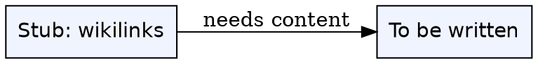
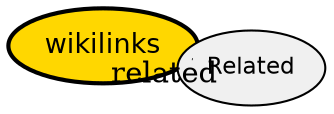

draft: true

## The Problem

Auto-created stub for broken link `[[wikilinks]]` — needs human content.

## Formal Definition

Per Wikipedia: "To be written."

## Explanation

Stub — fill with plain language explanation.

## How It Works

1. To be written.

## Visual Explanation



## Semantic Network



## Key Properties

- To be written.

## Real-World Example

```python
# TODO: add example
```

## Connections

- **Related:** [[index|Index]] — auto stub, needs proper links

## Edge Cases & Gotchas

- To be written.
