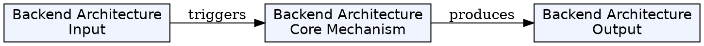
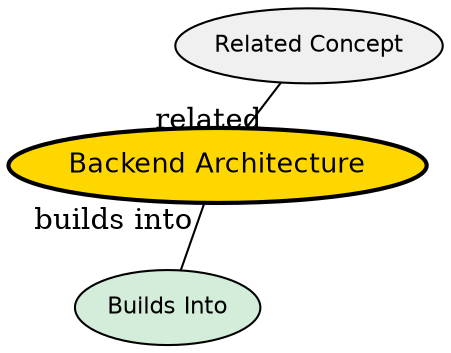

## The Problem

How do you structure a production backend system? A single monolithic server handling everything won't scale, won't handle failures gracefully, and becomes impossible to maintain. You need a well-structured architecture.

## Core Idea

Modern backend architecture typically layers into: Client → API Server → Database → Cache → Background Workers. Each layer has a specific responsibility. This separation allows independent scaling, fault isolation, and maintainability.

## How It Works

1. **Client Layer**: Front end (web, mobile) makes API requests
2. **API Server Layer**: Handles routing, business logic, request validation (Node.js, Python, Java)
3. **Database Layer**: Persistent storage for data (PostgreSQL, MongoDB)
4. **Cache Layer**: Fast in-memory storage for frequently accessed data (Redis)
5. **Background Workers**: Async processing for tasks that don't need immediate response (email, notifications, data processing)

The API server is the central hub--it receives requests, orchestrates logic, and coordinates with other layers.

## Key Properties

- Layered architecture separates concerns
- Each layer can scale independently
- Caching improves performance dramatically
- Background workers handle async tasks (don't block requests)
- Reverse proxies (Nginx) often sit in front for TLS termination, load balancing

## Visual Explanation

## Semantic Network

## Connections

- **Built from:** [[backend-as-program|Backend as Program]] -- the API server is a program
- **Builds into:** [[server|Server]] -- this architecture runs on server infrastructure
- **Related:** [[sql-database|SQL Database]] -- one database layer option
- **Related:** [[nosql-database|NoSQL Database]] -- another database option
- **Related:** [[redis|Redis]] -- common cache layer
- **Related:** [[backend-framework|Backend Framework]] -- provides the API server component

## Edge Cases & Gotchas

- Network calls between layers add latency
- Distributed systems introduce new failure modes
- Data consistency across layers is hard (cache invalidation)
- Too many layers adds complexity--balance with your scale