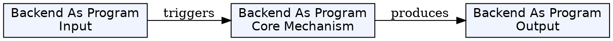
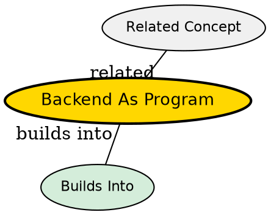

## The Problem

How do we build systems that can serve multiple clients, process data, and run continuously? Without understanding that backend is fundamentally a program, developers rely on frameworks without understanding what actually happens.

## Core Idea

A backend is simply a program running on a server that receives requests, processes logic, talks to databases, and sends responses. It's not a special machine--it's software that listens on a network port.

## How It Works

1. **Infinite Loop**: A backend server runs an infinite loop: wait for request → process request → send response
2. **Port Listening**: The program binds to a specific port (e.g., 8080) and waits for incoming connections
3. **Request Processing**: When a request arrives, the server parses it, executes business logic, may query databases
4. **Response**: The server sends back data in a structured format (typically JSON)
5. **Continuous Operation**: Servers run for months or years, handling thousands of requests

The key insight: your laptop can be a server. Running `python -m http.server 8000` makes your machine a web server.

## Key Properties

- Runs continuously (infinite loop)
- Listens on a specific port for connections
- Processes client requests and returns responses
- Can be written in any language (Python, Java, Go, Node.js)
- Not a physical machine--a program that can run anywhere

## Visual Explanation

## Semantic Network

## Connections

- **Built from:** [[socket|Socket]] -- the underlying mechanism that receives connections
- **Builds into:** [[server|Server]] -- when this program runs on a machine, it becomes the server
- **Builds into:** [[back-end|Back End]] -- the backend is the execution environment for this program
- **Contrasts with:** Front End -- runs on client, not server
- **Related:** [[client-server-model|Client-Server Model]] -- this program typically plays the server role

## Edge Cases & Gotchas

- A single server can handle many clients simultaneously because each gets its own socket connection
- Without proper error handling, one crashed request shouldn't crash the entire server
- The server must handle concurrent requests--either through threading, async, or event loops