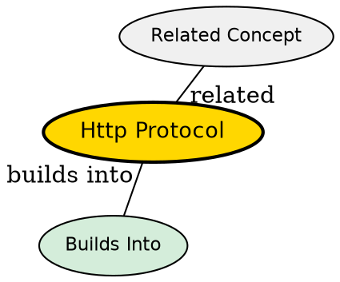

## The Problem

Without a standardized protocol, every client and server would need custom communication logic. Each request would need to define how to format data, indicate success/failure, handle errors. HTTP provides this shared language so any client can talk to any server.

## Core Idea

HTTP (Hypertext Transfer Protocol) is a text-based request-response protocol that defines how clients and servers exchange messages. It operates over TCP (or TLS for HTTPS), with a simple structure: method, path, headers, optional body. The server processes the request and returns a status code, headers, and body.

## How It Works

1. **Request Line**: Client sends "GET /users HTTP/1.1" specifying method, path, protocol version
2. **Headers**: Additional metadata like Host, Content-Type, Authorization
3. **Body**: For POST/PUT requests, data goes in the body (JSON, form data)
4. **Processing**: Server parses the request, runs logic, possibly queries database
5. **Response**: Server sends "HTTP/1.1 200 OK" with status code, headers, body

HTTP is stateless--each request is independent. Servers don't remember previous requests from the same client.

## Key Properties

- Text-based message format (HTTP/1.1), binary in HTTP/2
- Methods: GET (fetch), POST (create), PUT (update), DELETE (delete), PATCH (partial update)
- Status codes: 2xx (success), 3xx (redirect), 4xx (client error), 5xx (server error)
- Headers provide metadata: Content-Type, Authorization, Cache-Control
- Runs over TCP (port 80) or TLS (port 443 for HTTPS)

## Visual Explanation

## Semantic Network

## Connections

- **Built from:** [[socket|Socket]] -- HTTP runs over TCP socket connections
- **Built from:** [[tcp-handshake|TCP Handshake]] -- TCP establishes reliable connection first
- **Builds into:** [[api|API]] -- REST APIs use HTTP as the communication protocol
- **Contrasts with:** [[websocket|WebSocket]] -- WebSocket is bidirectional, HTTP is request-response
- **Related:** [[https|HTTPS]] -- HTTP over TLS encryption
- **Related:** [[http-methods|HTTP Methods]] -- specific operations defined in HTTP
- **Related:** [[http-status-codes|HTTP Status Codes]] -- response outcome codes

## Edge Cases & Gotchas

- HTTP is text-based--binary data must be encoded (Base64) or use multipart
- No inherent state--every request must re-authenticate or send session tokens
- Headers have size limits, bodies can be arbitrarily large
- Without keep-alive, every request needs a new TCP connection (slow)