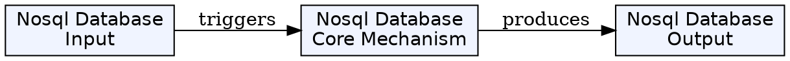
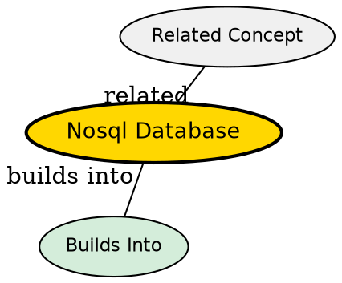

## The Problem

What if your data doesn't fit neatly into tables? What if you need to scale horizontally across many servers, or your data structure changes frequently? SQL's rigid schema becomes a limitation--NoSQL provides flexibility.

## Core Idea

NoSQL databases store data in flexible, schema-less formats: documents (JSON-like), key-value pairs, wide-column stores, or graphs. There's no fixed table structure--each record can have different fields. This makes them ideal for rapidly evolving data models and massive scale.

## How It Works

1. **Flexible Schema**: Store any JSON-like document without predefined structure
2. **Insertion**: Simply push documents with any fields--no ALTER TABLE needed
3. **Querying**: Query by any field, though queries can be less powerful than SQL joins
4. **Scaling**: Designed for horizontal scaling--add more servers easily
5. **Variants**: Document (MongoDB), Key-Value (Redis), Wide-Column (Cassandra), Graph (Neo4j)

Example: A user document might have `{name: "ani", followers: 1200}` in one record, and `{name: "rahul", tags: ["dev", "ai"]}` in another.

## Key Properties

- Flexible/dynamic schema--no rigid table definitions
- Horizontal scaling is native--designed for distributed systems
- Often sacrifices ACID for performance and scalability (BASE: Basically Available, Soft state, Eventual consistency)
- Optimized for specific use cases (key-value lookup, document storage, graph traversal)
- Popular: MongoDB, Redis, Cassandra, DynamoDB, Neo4j

## Visual Explanation

## Semantic Network

## Connections

- **Builds into:** [[backend-as-program|Backend as Program]] -- backend programs interact with NoSQL databases
- **Contrasts with:** [[sql-database|SQL Database]] -- different data model and trade-offs
- **Related:** [[redis|Redis]] -- popular key-value NoSQL store (also used for caching)
- **Related:** [[mongodb|MongoDB]] -- popular document database

## Edge Cases & Gotchas

- No foreign keys or joins--data duplication or application-level joins required
- Eventual consistency can be confusing (data may not appear immediately)
- Less powerful querying than SQL--can't do complex aggregations easily
- Schema-less means no compile-time validation--bugs can slip into production