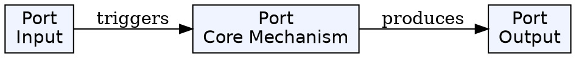
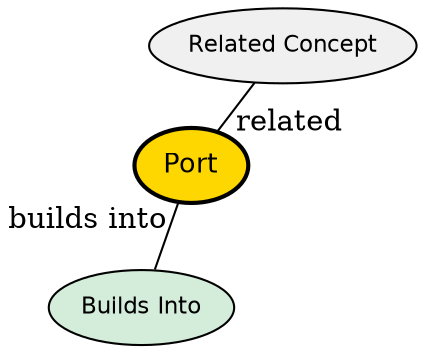

## The Problem

A single machine runs many services (web server, database, email, SSH). How do network packets know which service they're meant for? Without ports, all incoming traffic would go to the same destination.

## Core Idea

A port is a 16-bit number (0-65535) that identifies a specific service or application on a machine. While IP identifies which machine, port identifies which program on that machine. Together (IP:port), they uniquely identify a network endpoint.

## How It Works

1. **Identification**: When a server starts a service, it binds to a specific port (e.g., HTTP = 80, HTTPS = 443)
2. **Listening**: The server listens on that port for incoming connections
3. **Routing**: When packets arrive, the OS uses the port number to forward data to the correct application
4. **Response**: The service sends responses back through the same port

Example: connecting to 142.250.183.46:443 means: connect to machine 142.250.183.46, port 443 (HTTPS service).

## Key Properties

- 16-bit number: 0-65535
- Well-known ports (0-1023): reserved for standard services (HTTP=80, HTTPS=443, SSH=22, PostgreSQL=5432)
- Registered ports (1024-49151): assigned to specific applications
- Dynamic ports (49152-65535): used for client-side ephemeral connections
- Multiple services can run on one machine if they use different ports

## Visual Explanation

## Semantic Network

## Connections

- **Built from:** [[ip-address|IP Address]] -- ports are combined with IP to form a socket
- **Builds into:** [[socket|Socket]] -- a socket is IP + port
- **Related:** [[dns|DNS]] -- domain names resolve to IP, then ports route to specific services
- **Related:** [[server|Server]] -- servers listen on specific ports
- **Related:** [[http|HTTP]] -- typically runs on port 80 (HTTP) or 443 (HTTPS)

## Edge Cases & Gotchas

- Only one application can bind to a port at a time
- Ports below 1024 require root/admin privileges on Unix systems
- Firewall rules can block specific ports
- Port conflicts cause "address already in use" errors