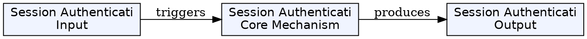
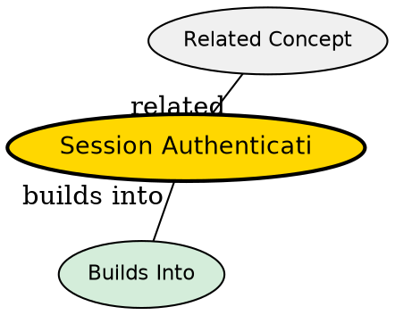

## The Problem

HTTP is stateless--each request is independent. How does the server remember you're logged in after you submit the login form? Without sessions, every request would require re-entering credentials. Sessions solve this by creating persistent authenticated state.

## Core Idea

Session authentication works by: user logs in → server creates a session ID → server stores session data → server sends session ID as a cookie → browser sends cookie with every request → server looks up session and knows who you are.

## How It Works

1. **Login**: User submits credentials (username/password)
2. **Session Creation**: Server verifies credentials, creates a session (stores user ID in memory/database)
3. **Cookie**: Server sends session ID to browser as a cookie (Set-Cookie header)
4. **Subsequent Requests**: Browser automatically sends cookie with each request
5. **Verification**: Server looks up session by ID, retrieves user info, processes request
6. **Logout**: Server destroys session, browser clears cookie

The session ID is just a random string--the actual user data stays on the server (secure).

## Key Properties

- Server-side session storage (memory, Redis, database)
- Session ID stored in browser cookie (HttpOnly, secure flags for security)
- Sessions can expire (timeout) or be explicitly invalidated (logout)
- Server can store additional data in session (permissions, preferences)
- Classic approach used by traditional web applications

## Visual Explanation

## Semantic Network

## Connections

- **Built from:** [[http|HTTP]] -- sessions use HTTP cookies
- **Builds into:** [[backend-as-program|Backend as Program]] -- backend handles session management
- **Contrasts with:** [[jwt-authentication|JWT Authentication]] -- different stateless approach
- **Related:** [[cookie|Cookie]] -- the mechanism for storing session ID on client

## Edge Cases & Gotchas

- Session storage fills memory on server--need external store (Redis) for scaling
- Cookies are vulnerable to XSS if not HttpOnly--attacker can steal session ID
- CSRF attacks can exploit sessions--need CSRF tokens
- Session hijacking--use secure, HttpOnly cookies and consider regenerating IDs