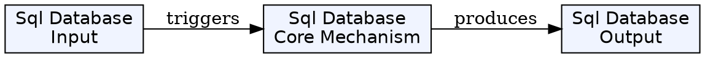
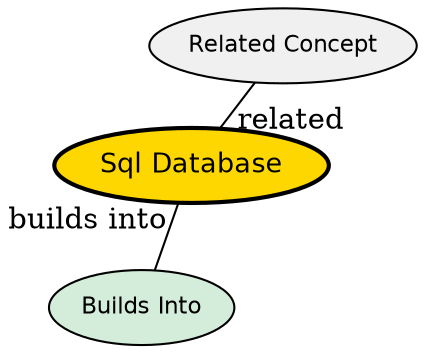

## The Problem

How do we store data in a structured, organized way that ensures data integrity, enables complex queries, and maintains relationships between different pieces of information? Flat files can't handle this--SQL databases provide the solution.

## Core Idea

SQL (Structured Query Language) databases store data in rigidly defined tables with rows and columns. Each table has a schema that defines what columns exist and what types they hold. Relationships between tables are defined through foreign keys, enabling joins and complex queries.

## How It Works

1. **Schema Definition**: You define tables with columns and data types (e.g., users table has id, name, email)
2. **Data Insertion**: Insert rows into tables following the schema
3. **Querying**: Use SELECT statements to fetch data, with JOINs to combine tables
4. **Relationships**: Foreign keys link tables (users.id = orders.user_id)
5. **Transactions**: Group multiple operations that must all succeed or all fail together

Example: `SELECT * FROM users WHERE name = 'ani'` returns all rows from users table matching the condition.

## Key Properties

- ACID compliant: Atomicity, Consistency, Isolation, Durability
- Predefined schema--all data must conform to table structure
- Powerful queries with JOINs, aggregations, subqueries
- Primary keys, foreign keys enforce relationships and data integrity
- Popular: PostgreSQL, MySQL, SQLite, Oracle

## Visual Explanation

## Semantic Network

## Connections

- **Builds into:** [[api|API]] -- backends query databases to serve API responses
- **Builds into:** [[backend-as-program|Backend as Program]] -- backend programs interact with databases
- **Contrasts with:** [[nosql-database|NoSQL Database]] -- different data model and trade-offs
- **Related:** [[sql-query|SQL Query]] -- the language used to interact with SQL databases

## Edge Cases & Gotchas

- Schema changes require migrations (adding columns to production tables is complex)
- Horizontal scaling is harder than NoSQL--sharding adds complexity
- Complex joins can be slow on large datasets
- Object-relational impedance mismatch--mapping objects to tables is work