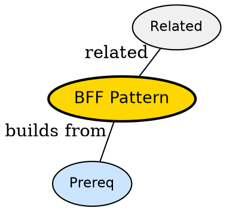

## The Problem

One backend serving web, iOS and Android ends up bloated -- how do you tailor backend responses for each front end without duplicating logic?

## Formal Definition

Per Wikipedia: "The Backend for Frontend pattern provides a separate backend service per front-end type that aggregates and shapes data for that UI."

## Explanation

Like a concierge for each hotel wing -- web concierge and mobile concierge both call the same kitchens but pack the tray differently.

## How It Works

1. Identify front ends needing different shapes
2. Create BFF service per front end
3. BFF calls downstream microservices
4. BFF aggregates and trims payload
5. Front end calls only its BFF

## Visual Explanation


## Semantic Network



## Key Properties

- Reduces over-fetching for mobile
- Lets each UI evolve independently
- Adds operational overhead of extra service
- Should not contain business logic

## Real-World Example

```python
 # BFF aggregates
def get_home(user_id):
    profile = users_svc.get(user_id)
    feed = feed_svc.get(user_id)
    return {'profile': profile, 'feed': feed[:10]}
```

## Connections

- **Built from:** [[client-server-model|Client-Server Model]] -- BFF is a specialized server
- **Related:** [[back-end|Back End]] -- BFF is a back-end kind
- **Related:** [[front-end|Front End]] -- BFF serves a specific front end
- **Builds into:** [[scalability|Scalability]] -- avoids chatty mobile calls

## Edge Cases & Gotchas

- BFF per pixel -- creating BFF per screen not per platform
- Leaking domain logic into BFF -- becomes monolith
