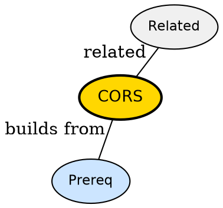

## The Problem

Browser blocks fetch from api.example.com when page is on app.example.com -- why does the same code work in curl but not in browser?

## Formal Definition

Per Wikipedia: "CORS is a browser security mechanism that blocks cross-origin requests unless server sends Access-Control-Allow-Origin headers."

## Explanation

CORS is the bouncer checking the guest list -- same-origin is allowed in, cross-origin needs explicit invite from server.

## How It Works

1. Browser sends Origin header
2. Server checks allow list
3. Server replies with ACAO header if allowed
4. Browser enforces -- blocks if missing
5. Preflight OPTIONS for non-simple requests

## Visual Explanation


## Semantic Network



## Key Properties

- Only enforced by browsers, not by curl
- Simple GET/POST may skip preflight
- Credentials need explicit Allow-Credentials

## Real-World Example

```python
fetch('https://api.example.com/data', {mode: 'cors'})
  .then(r => r.json())
```

## Connections

- **Built from:** [[http-api|HTTP API]] -- CORS protects HTTP APIs
- **Related:** [[client|Client]] -- client triggers CORS
- **Related:** [[server|Server]] -- server configures CORS
- **Contrasts with:** [[api|API]] -- API without browser has no CORS

## Edge Cases & Gotchas

- Wildcard * with credentials fails -- must list origin
- Caching preflight without Vary: Origin causes leaks
