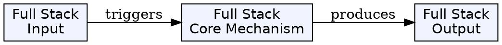
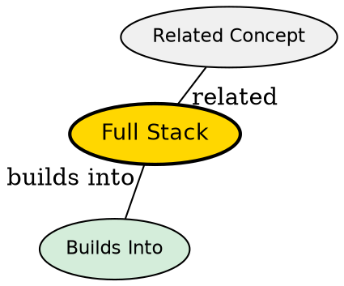

## The Problem

Modern software development requires understanding both client-side and server-side technologies. How do developers work across the entire application stack?

## Core Idea

Full stack refers to both the front end (presentation layer) and back end (data management/processing) together. A full stack developer has knowledge of the entire application from UI to database.

## How It Works

Full stack developers understand:

1. **Front End**: HTML, CSS, JavaScript, frameworks (React, Angular, Vue.js)
2. **Back End**: Server languages (Node.js, Python, Java, PHP), APIs
3. **Database**: SQL, NoSQL, data modeling, queries
4. **Version Control**: Git and collaboration tools
5. **DevOps**: Deployment, CI/CD, infrastructure basics
6. **Architecture**: Understanding how components fit together

The developer can work on any part of the application, from user interface to database, bridging the gap between front end and back end.

## Key Properties

- Encompasses both front end and back end
- Requires knowledge across multiple technology layers
- Can build complete, functional applications independently
- Understands data flow from UI to database and back
- Uses version control tools (Git, Mercurial, Subversion)
- Uses file transfer tools (FTP, rsync) for deployment

## Visual Explanation

## Semantic Network

## Connections

**Built from:**

- [[front-end|Front End]] -- One half of full stack
- [[back-end|Back End]] -- The other half of full stack
- [[client-server-model|Client-Server Model]] -- Underlying architecture

**Related:**

- [[api|API]] -- Full stack developers work with APIs extensively
- [[version-control|Version Control]] -- Essential tool for full stack developers

## Edge Cases & Gotchas

- Full stack is a spectrum--nobody knows everything
- Deep expertise in one area often more valuable than shallow knowledge everywhere
- Technology constantly changes--continuous learning required