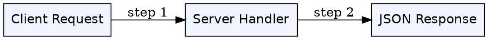
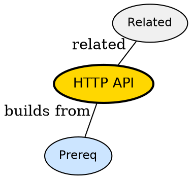

## The Problem

Front end and back end need a contract to talk -- what format do requests and responses follow when a browser calls a server?

## Formal Definition

Per Wikipedia: "An HTTP API is an interface that exposes application functionality over HTTP using verbs, paths, headers and status codes."

## Explanation

Think of an API as a menu in a restaurant. The front end orders by calling a URL, the back end cooks and returns JSON. HTTP just defines how the waiter carries the order.

## How It Works

1. Client forms HTTP request with method and URL
2. Server routes request to handler
3. Handler runs business logic and queries data
4. Server formats JSON response with status code
5. Client parses response and updates UI

## Visual Explanation



## Semantic Network



## Key Properties

- Stateless -- each request carries its own auth and context
- Uses standard verbs GET POST PUT DELETE
- Versioned via URL or header
- Errors signaled via status codes

## Real-World Example

```python
# Minimal HTTP API call
import requests
resp = requests.get('https://api.example.com/users/1')
print(resp.status_code, resp.json())
```

## Connections

- **Built from:** [[client-server-model|Client-Server Model]] -- API is the contract inside that model
- **Built from:** [[api|API]] -- specialization of generic API for HTTP
- **Related:** [[server|Server]] -- server implements the API
- **Contrasts with:** [[front-end|Front End]] -- front end consumes the API

## Edge Cases & Gotchas

- Forgetting pagination on list endpoints paginates in client not server
- Mixing HTTP verbs -- GET should not change state
