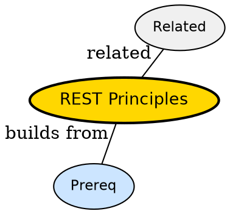

## The Problem

Teams argue whether an API is RESTful but have no checklist -- what makes an API actually REST and not just JSON over HTTP?

## Formal Definition

Per Wikipedia: "Per Fielding: REST is an architectural style with constraints -- client-server, stateless, cacheable, uniform interface, layered system, code on demand (optional)."

## Explanation

REST is like a vending machine -- every button press is a self-contained request, the machine does not remember you, and every product has a clear address.

## How It Works

1. Model resources as nouns with URLs (/users/42)
2. Use HTTP verbs for actions
3. Make each request stateless with auth header
4. Make responses cacheable with headers
5. Use hypermedia or links for discoverability

## Visual Explanation


## Semantic Network



## Key Properties

- Resource-oriented not action-oriented
- Cacheable and layered
- Uniform interface reduces coupling
- Stateless simplifies scaling

## Real-World Example

```python
from flask import Flask
app = Flask(__name__)
@app.get('/users/<id>')
def get_user(id): return {'id': id}
```

## Connections

- **Built from:** [[http-api|HTTP API]] -- REST refines HTTP API design
- **Related:** [[api|API]] -- REST is a style of API
- **Builds into:** [[scalability|Scalability]] -- stateless helps scale
- **Contrasts with:** [[full-stack|Full Stack]] -- full stack may bypass strict REST

## Edge Cases & Gotchas

- Over-REST-ing -- tunneling actions through POST /doThing breaks resource model
- Ignoring idempotency -- retrying POST creates duplicates
