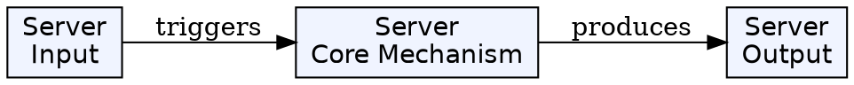
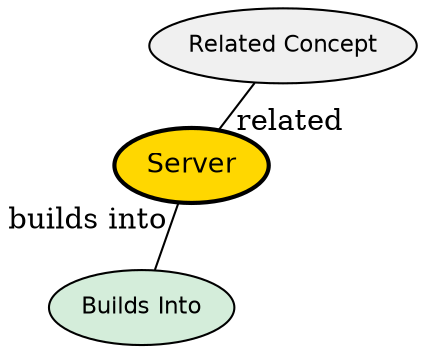

## The Problem

How do you provide shared resources and services to multiple clients? What handles the data processing and storage that clients cannot or should not handle?, how do we assume that the client is not 

## Core Idea

A server is a computer or software that provides services to other computers (clients) over a network. In the client-server model, the server is typically the back end, managing data and logic.

## How It Works

1. **Listening**: Server listens for client requests on specific ports
2. **Request Handling**: Receives, processes, and responds to client requests
3. **Resource Management**: Manages shared resources (databases, files, computation)
4. **Authentication**: Verifies client identity before granting access
5. **Data Processing**: Executes business logic and manipulates data
6. **Response**: Returns results to the client

Servers can be physical machines, virtual machines, or containers. They typically run continuously and are more powerful than client machines.

## Key Properties

- Provides services to multiple clients simultaneously
- Usually runs remotely, physically separated from clients
- Handles data storage, processing, and business logic
- Can be scaled horizontally (more machines) or vertically (more resources)
- High availability often requires redundancy

## Visual Explanation

## Semantic Network

## Connections

**Builds into:**

- [[back-end|Back End]] -- Server typically runs back end components

**Related:**

- [[client-server-model|Client-Server Model]] -- Server is one side of the model
- [[front-end|Front End]] -- Client counterpart to server

## Edge Cases & Gotchas

- Server downtime affects all clients
- Security critical--servers are attack targets
- Performance bottlenecks can affect all users