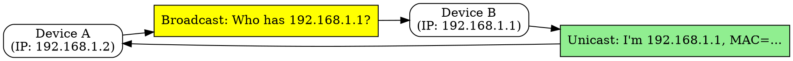

## The Problem
Devices know the destination IP address but need the MAC (hardware) address to send frames on the local network. A mechanism is needed to map IP addresses to MAC addresses.

## Core Idea
A protocol that resolves IP addresses to MAC addresses within a local network by broadcasting a request and receiving a unicast reply from the owner of the IP.

## How It Works
1. Device wants to send to IP address on same LAN
2. Device checks ARP cache for existing IP-to-MAC mapping
3. If not cached, device broadcasts ARP request: "Who has IP 192.168.1.1?"
4. Target device with that IP sends unicast ARP reply: "I have it, my MAC is AA:BB:CC:DD:EE:FF"
5. Sender caches the mapping and sends the frame

## Visual Explanation

## Key Properties
- Resolves IP to MAC addresses on local network
- Uses broadcast for requests, unicast for replies
- Maintains ARP cache to avoid repeated lookups
- Works at the link layer (between network and link layers)

## Connections
- Built from: [[ip-protocol|IP Protocol]] — resolves IP addresses
- Built from: [[mac-address|MAC Address]] — what ARP discovers
- Related: [[local-area-network|LAN]] — operates within single network
- Related: [[arp-cache|ARP Cache]] — stores recent resolutions

## Edge Cases & Gotchas
- ARP spoofing/poisoning: attacker can send fake ARP replies to intercept traffic
- ARP cache timeout: entries expire and must be re-resolved
- Doesn't work across routers (routers don't forward broadcasts)