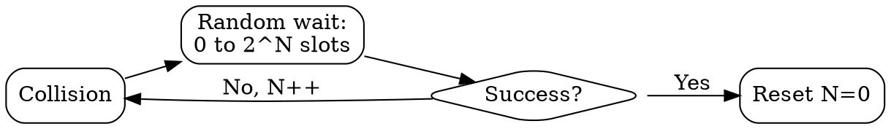

## The Problem
After a collision, if all devices retry immediately, they'll collide again. A randomized waiting mechanism is needed to reduce the probability of repeated collisions.

## Core Idea
An algorithm where the maximum random wait time doubles after each successive collision, reducing retry attempts when the network is congested.

## How It Works
1. First collision: wait random time between 0 and 1 slot time
2. Second collision: wait random time between 0 and 2 slot times
3. Third collision: wait random time between 0 and 4 slot times
4. Nth collision: wait random time between 0 and 2^N slot times (capped at 1024)
5. After successful transmission, the backoff counter resets

## Visual Explanation

## Key Properties
- Reduces collision probability under high load
- Wait time grows exponentially with repeated collisions
- Capped at maximum backoff (e.g., 1024 slots in Ethernet)
- Used in CSMA/CD and some wireless protocols

## Connections
- Built from: [[csma-cd|CSMA/CD]] — uses this backoff algorithm
- Related: [[collision|Collision]] — triggers backoff
- Related: [[jam-signal|Jam Signal]] — sent before backoff
- Related: [[random-access|Random Access]] — broader category of protocols using backoff

## Edge Cases & Gotchas
- Maximum backoff limit prevents excessive wait times
- Many collisions can still cause long delays (exponential growth)
- Not used in modern full-duplex Ethernet (no collisions to back off from)

## Sources
- [[cn-summary|Computer Networks Gemini Conversation]]
