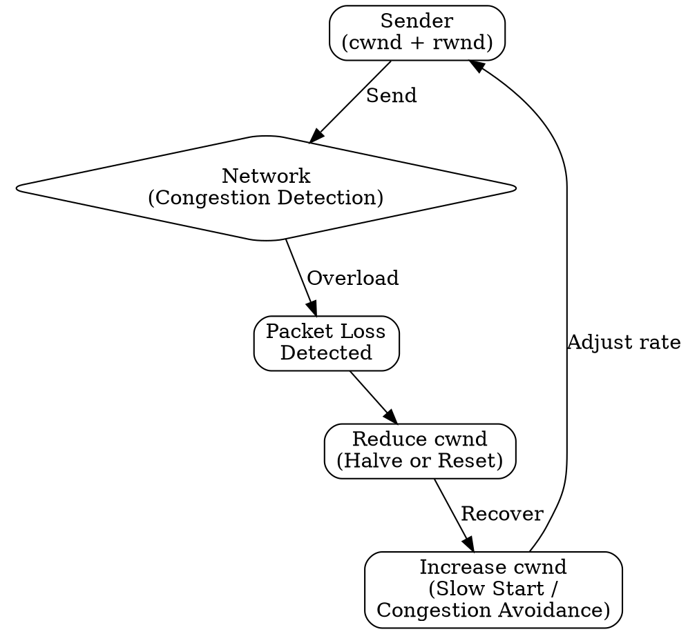

# Congestion Control

## The Problem
When too many senders transmit too fast, network routers become overloaded, leading to packet loss and reduced throughput for everyone. Individual flow control can't prevent this because the bottleneck is the network, not the receiver.

## Core Idea
A set of algorithms that detect network congestion and reduce sending rate to prevent overwhelming the network, then increase rate when congestion clears.

## How It Works
1. Sender maintains a congestion window (cwnd) limiting unacknowledged data
2. Effective window = min(receive window, congestion window)
3. Slow start: exponentially increase cwnd until packet loss detected
4. Congestion avoidance: linearly increase cwnd after slow start threshold
5. Fast retransmit: retransmit on duplicate ACKs without waiting for timeout
6. Fast recovery: halve cwnd and continue after fast retransmit

## Visual Explanation

## Key Properties
- Network-driven: responds to network congestion signals (loss, delay)
- Uses congestion window separate from flow control window
- Multiple algorithms: slow start, congestion avoidance, fast retransmit, fast recovery
- Essential for internet stability

## Connections
- Built from: [[sliding-window-protocol|Sliding Window Protocol]] — window-based mechanism
- Built from: [[packet-loss|Packet Loss]] — primary congestion signal
- Builds into: [[tcp|TCP]] — implements congestion control
- Related: [[flow-control|Flow Control]] — receiver-based vs network-based
- Contrasts with: [[flow-control|Flow Control]] — different control objective

## Edge Cases & Gotchas
- Bufferbloat: large router buffers hide congestion, causing high latency
- TCP fairness: different TCP variants compete differently for bandwidth
- Congestion control vs congestion avoidance: detection vs prevention strategies

## Sources
- [[cn-summary|Computer Networks Gemini Conversation]]
