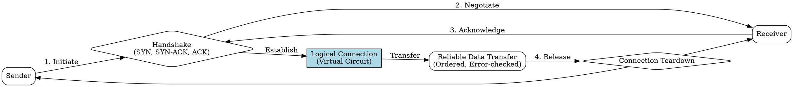

## The Problem
Network communication needs reliable, ordered delivery for applications like web browsing and file transfers. Without a connection-oriented approach, data might arrive out of order, get lost, or overwhelm receivers.

## Core Idea
A service that establishes a dedicated logical connection between sender and receiver before exchanging data, guaranteeing reliable, ordered delivery with flow and congestion control.

## How It Works
1. A connection establishment phase occurs using a handshake (e.g., TCP three-way handshake: SYN, SYN-ACK, ACK)
2. Both endpoints maintain state information including sequence numbers, acknowledgments, and buffer sizes
3. Data is delivered reliably with guaranteed ordering, error checking, and retransmission of lost packets
4. Flow control prevents fast senders from overwhelming slow receivers
5. Congestion control manages network traffic to prevent bottlenecks
6. A teardown phase releases the connection when communication ends

## Visual Explanation

## Key Properties
- Guaranteed delivery through retransmission of lost packets
- Ordered delivery preserving send sequence
- Stateful: both endpoints maintain connection state
- Higher overhead due to setup, maintenance, and reliability mechanisms
- Uses a logical path (virtual circuit) for the connection duration

## Connections
- Built from: [[three-way-handshake|Three-Way Handshake]] — connection establishment mechanism
- Built from: [[reliable-data-transfer|Reliable Data Transfer]] — core guarantee provided
- Builds into: [[tcp|TCP]] — primary protocol implementing this service
- Contrasts with: [[connectionless-service|Connectionless Service]] — no setup or reliability guarantees
- Related: [[flow-control|Flow Control]] — prevents receiver overload
- Related: [[congestion-control|Congestion Control]] — manages network bottlenecks

## Edge Cases & Gotchas
- Higher latency due to connection setup overhead
- State maintenance consumes memory on both endpoints
- Connection state can be lost during network failures requiring re-establishment
- Not suitable for bursty, small messages where setup cost dominates