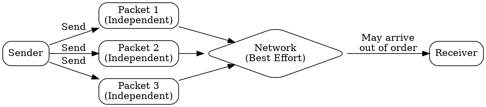

# Connectionless Service

## The Problem
Some applications need fast, low-latency communication where occasional packet loss is acceptable. Setting up connections for every small message wastes bandwidth and adds delay.

## Core Idea
A service where packets are sent independently without connection setup, offering best-effort delivery with no guarantees of order, reliability, or flow control.

## How It Works
1. No handshake or connection establishment before sending data
2. Each packet (datagram) is treated independently with full addressing information
3. Packets may take different network paths and arrive out of order or not at all
4. No retransmission mechanism at this service layer
5. No flow control or congestion control — sender transmits at will
6. Stateless: neither endpoint maintains communication state

## Visual Explanation

## Key Properties
- No connection setup, teardown, or state maintenance
- Best-effort delivery with no guarantees
- Lower overhead and faster than connection-oriented
- Each packet routed independently
- Stateless operation at the service layer

## Connections
- Built from: [[ip-protocol|IP Protocol]] — network layer connectionless foundation
- Builds into: [[udp|UDP]] — primary transport layer implementation
- Contrasts with: [[connection-oriented-service|Connection-Oriented Service]] — reliable vs best-effort
- Related: [[datagram|Datagram]] — independent packet unit used
- Related: [[best-effort-delivery|Best Effort Delivery]] — no delivery guarantees

## Edge Cases & Gotchas
- Applications must handle reliability at higher layers if needed
- Packet loss goes undetected unless application implements checking
- No backpressure mechanism — can overwhelm receiver or network
- Out-of-order delivery requires application-level reordering

## Sources
- [[cn-summary|Computer Networks Gemini Conversation]]
