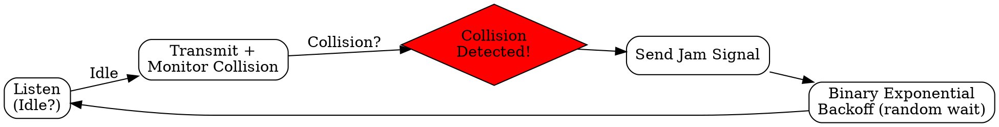

# CSMA/CD

## The Problem
CSMA reduces collisions but doesn't handle them when they occur. Once a collision happens, devices keep transmitting garbage, wasting bandwidth until the packet finishes.

## Core Idea
An extension of CSMA that detects collisions during transmission and immediately stops, then uses a backoff algorithm before retrying, minimizing wasted bandwidth.

## How It Works
1. Device listens before transmitting (carrier sense)
2. If idle, start transmitting AND continuously monitor for collision
3. If collision detected (signal strength changes): stop transmitting immediately
4. Send a jam signal to notify all devices of the collision
5. Wait a random time (binary exponential backoff) before retrying

## Visual Explanation

## Key Properties
- Listens before AND during transmission
- Detects collisions quickly and stops transmission
- Uses binary exponential backoff to reduce retry collisions
- Standard for traditional wired Ethernet (10/100 Mbps)

## Connections
- Built from: [[csma|CSMA]] — adds collision detection to basic CSMA
- Built from: [[jam-signal|Jam Signal]] — notifies others of collision
- Built from: [[binary-exponential-backoff|Binary Exponential Backoff]] — retry algorithm
- Related: [[collision-detection|Collision Detection]] — the key addition over CSMA
- Contrasts with: [[csma-ca|CSMA/CA]] — detection vs avoidance

## Edge Cases & Gotchas
- Only works on wired networks (can't detect collision in wireless due to hidden terminal)
- Not used in modern full-duplex Ethernet (switches eliminate collisions)
- Maximum network diameter limited by collision detection time (slot time)

## Sources
- [[cn-summary|Computer Networks Gemini Conversation]]
