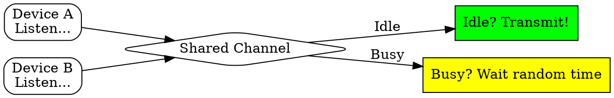

# CSMA

## The Problem
Multiple devices share a single communication channel (like Ethernet). If two devices transmit simultaneously, their signals collide and data is lost. A mechanism is needed to minimize collisions.

## Core Idea
A protocol where devices listen to the channel (carrier sense) before transmitting, and wait if the channel is busy, reducing but not eliminating collisions.

## How It Works
1. Device wants to transmit: first listens to the channel (carrier sense)
2. If channel is idle: transmit the data
3. If channel is busy: wait for a random time, then check again
4. If channel becomes idle: transmit
5. Collision can still occur if two devices sense idle at the same time and both start transmitting

## Visual Explanation

## Key Properties
- "Listen before talk" approach
- Reduces collisions compared to pure ALOHA
- Does not eliminate collisions completely
- Used in wireless and wired shared media

## Connections
- Built from: [[carrier-sense|Carrier Sense]] — the listening mechanism
- Builds into: [[csma-cd|CSMA/CD]] — adds collision detection
- Contrasts with: [[csma-ca|CSMA/CA]] — collision avoidance vs detection
- Related: [[multiple-access|Multiple Access]] — broader category of protocols
- Related: [[collision|Collision]] — what CSMA tries to avoid

## Edge Cases & Gotchas
- Propagation delay causes collisions: device may sense idle while a transmission is in progress but hasn't arrived yet
- "Hidden terminal" problem in wireless (not solved by CSMA alone)
- Efficiency depends on propagation delay vs packet transmission time

## Sources
- [[cn-summary|Computer Networks Gemini Conversation]]
