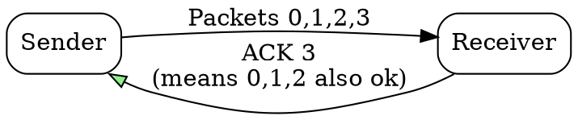

## The Problem
Sending an ACK for every received packet creates overhead. A more efficient approach is needed to acknowledge multiple packets with a single ACK.

## Core Idea
An acknowledgment that confirms receipt of all packets up to and including a specific sequence number, not just the single packet being acknowledged.

## How It Works
1. Receiver gets packets 0, 1, 2, 3 in order
2. Receiver sends ACK for packet 3, meaning "I have received all packets up to 3"
3. Sender receives ACK 3 and knows packets 0, 1, 2, 3 were all received
4. If packet 1 is lost but 2, 3 arrive, receiver keeps ACKing 0 (last in-order packet)
5. Used by Go-Back-N and TCP

## Visual Explanation

## Key Properties
- Reduces number of ACK packets needed
- Confirms receipt through a sequence number
- Used by Go-Back-N and TCP (with selective ACK option available)
- If gap detected, ACK stays at last in-order packet

## Connections
- Built from: [[acknowledgment|Acknowledgment]] — cumulative is a type of ACK
- Built from: [[go-back-n|Go-Back-N ARQ]] — uses cumulative ACKs
- Built from: [[tcp|TCP]] — uses cumulative ACKs (default behavior)
- Contrasts with: [[selective-repeat|Selective Repeat]] — individual ACKs vs cumulative

## Edge Cases & Gotchas
- Doesn't identify which specific packets are missing (just the last contiguous one)
- TCP selective ACK (SACK) option extends cumulative ACK to identify gaps
- Duplicate ACKs (same cumulative ACK repeated) can signal packet loss

## Sources
- [[cn-summary|Computer Networks Gemini Conversation]]
