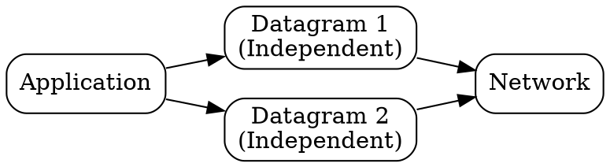

## The Problem
Connectionless services need a unit of data that is self-contained with all necessary addressing, so it can be routed independently without connection state.

## Core Idea
A self-contained, independent packet in a connectionless service that carries its own addressing and can take any path to the destination.

## How It Works
1. Application data is encapsulated in a datagram with source and destination addresses/ports
2. Each datagram is treated independently by the network
3. Datagrams may take different paths and arrive out of order
4. No relationship between consecutive datagrams (no connection state)
5. UDP packets are datagrams; IP packets are also datagrams

## Visual Explanation

## Key Properties
- Self-contained with full addressing
- No connection state maintained
- Can arrive out of order or not at all
- Used by UDP and IP (connectionless protocols)

## Connections
- Built from: [[connectionless-service|Connectionless Service]] — datagrams are the unit of transfer
- Built from: [[udp|UDP]] — uses datagrams
- Built from: [[ip-protocol|IP Protocol]] — IP packets are datagrams
- Contrasts with: [[virtual-circuit|Virtual Circuit]] — independent vs stateful path

## Edge Cases & Gotchas
- No delivery guarantees — applications must handle loss
- Datagram size limits (UDP: 65,507 bytes minus IP header; practical limit often 1,500 bytes due to MTU)
- Fragmentation at IP layer if datagram exceeds MTU