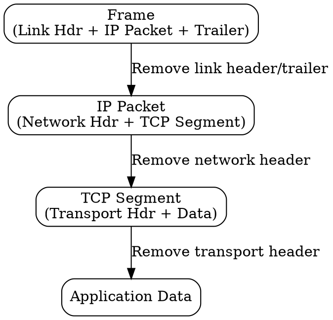

## The Problem
When a packet arrives at its destination, each layer needs to extract and process its own header, then pass the remaining data up to the next layer. Without decapsulation, the receiving application would get raw bits with no structure.

## Core Idea
The process of removing layer-specific headers (and trailers) as data moves up the protocol stack from the physical layer to the application.

## How It Works
1. Physical layer receives bits and passes to link layer
2. Link layer processes frame header and trailer, extracts IP packet, passes up
3. Network layer processes IP header, extracts transport segment, passes up
4. Transport layer processes TCP/UDP header, extracts application data, passes to application
5. Application receives the original data

## Visual Explanation

## Key Properties
- Reverse of encapsulation
- Each layer processes and removes its header
- Passes payload to next higher layer
- Errors detected at each layer (if error checking exists)

## Connections
- Contrasts with: [[encapsulation|Encapsulation]] — unwrapping vs wrapping
- Built from: [[layered-model|Layered Model]] — decapsulation happens between layers
- Related: [[protocol-header|Protocol Header]] — what gets removed
- Related: [[error-detection|Error Detection]] — often checked during decapsulation

## Edge Cases & Gotchas
- If a layer detects an error (bad checksum), it may discard the packet
- Some layers may not have a header to remove (e.g., physical layer)
- Tunneling requires recursive decapsulation (decapsulate inner packet)