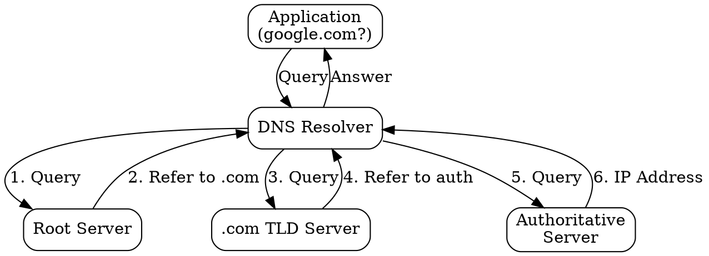
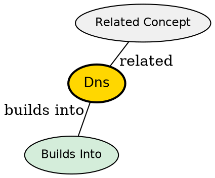

## The Problem
Humans remember domain names (google.com) but network protocols use IP addresses (142.250.191.78). Without a translation system, users would need to memorize numeric addresses for every website.

## Core Idea
A distributed hierarchical system that translates human-readable domain names into IP addresses, acting as the internet's phonebook.

## How It Works
1. Application requests IP for a domain name (e.g., google.com)
2. DNS resolver checks cache, then queries root servers, TLD servers, and authoritative servers
3. Responses are cached to improve performance
4. Primarily uses UDP for queries (port 53) due to speed requirements
5. Falls back to TCP for large responses (zone transfers) or when UDP is blocked

## Visual Explanation

## Key Properties
- Hierarchical distributed database
- Uses UDP primarily (fast, low overhead) with TCP fallback
- Caching reduces query latency and server load
- Critical infrastructure -- internet unusable without it

## Semantic Network

## Connections
- Built from: [[udp|UDP]] -- primary transport protocol used
- Built from: [[application-layer|Application Layer]] -- operates at this layer
- Related: [[ip-protocol|IP Protocol]] -- returns IP addresses
- Related: [[dns-cache|DNS Cache]] -- improves performance

## Edge Cases & Gotchas
- DNS cache poisoning can redirect users to malicious sites
- DNS over HTTPS (DoH) encrypts queries for privacy
- Zone transfers use TCP, not UDP, due to large data sizes