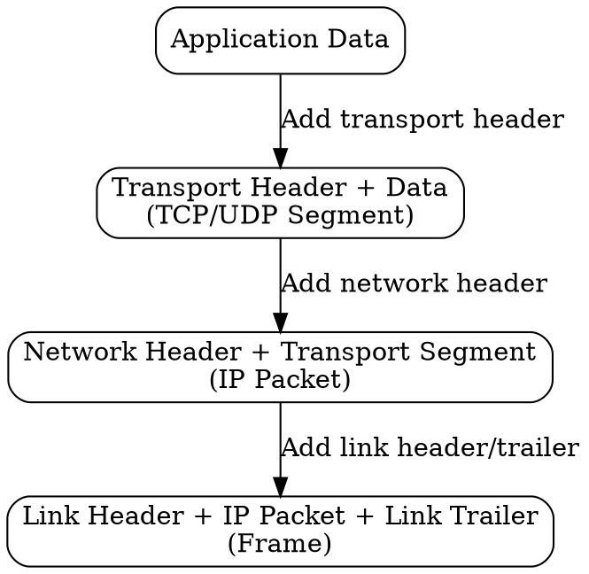

## The Problem
Each network layer needs to add its own control information (headers) to data as it passes down the protocol stack. Without encapsulation, there would be no way to distinguish which layer a particular piece of information belongs to.

## Core Idea
The process of wrapping data with layer-specific headers (and sometimes trailers) as it moves down the protocol stack from the application to the physical layer.

## How It Works
1. Application data is passed to the transport layer
2. Transport layer adds its header (e.g., TCP or UDP header) — now a segment/datagram
3. Network layer adds its header (IP header) — now a packet
4. Link layer adds its header and trailer (frame header + FCS trailer) — now a frame
5. Physical layer converts to bits for transmission

## Visual Explanation

## Key Properties
- Each layer adds its own header
- Headers contain layer-specific control information
- Reverse process (decapsulation) happens at receiver
- Enables layering and protocol independence

## Connections
- Built from: [[layered-model|Layered Model]] — encapsulation happens between layers
- Contrasts with: [[decapsulation|Decapsulation]] — wrapping vs unwrapping
- Related: [[protocol-header|Protocol Header]] — what gets added
- Related: [[tcp-segment|TCP Segment]] — example of encapsulated unit

## Edge Cases & Gotchas
- Overhead: each layer adds bytes, reducing effective payload size
- MTU limits: encapsulated packet must fit link-layer MTU (may require fragmentation)
- Tunneling: encapsulation can nest (e.g., PPPoE encapsulates PPP in Ethernet)

## Sources
- [[cn-summary|Computer Networks Gemini Conversation]]
