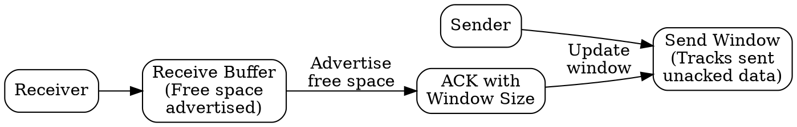

## The Problem
A fast sender can overwhelm a slow receiver by sending data faster than the receiver can process it, causing buffer overflow and packet loss even when the network is fine.

## Core Idea
A mechanism that prevents a sender from transmitting data faster than the receiver can accept it, typically by having the receiver advertise its available buffer space.

## How It Works
1. Receiver advertises its available receive buffer size in each ACK packet
2. Sender maintains a sending window limited by receiver's advertised window
3. Sender stops sending when window is exhausted
4. As receiver processes data and frees buffer, it sends ACKs with larger window advertisements
5. Sender resumes transmission within the new window

## Visual Explanation

## Key Properties
- Receiver-driven: receiver controls transmission rate
- Prevents receiver buffer overflow
- Implemented via sliding window with receiver-advertised limits
- Distinct from congestion control (which responds to network conditions)

## Connections
- Built from: [[sliding-window-protocol|Sliding Window Protocol]] — mechanism for window management
- Built from: [[receiver-buffer|Receiver Buffer]] — the resource being protected
- Builds into: [[tcp|TCP]] — implements flow control via receive window
- Related: [[connection-oriented-service|Connection-Oriented Service]] — key feature
- Contrasts with: [[congestion-control|Congestion Control]] — receiver vs network limited

## Edge Cases & Gotchas
- Zero-window condition: receiver advertises window=0, sender must probe periodically
- Silly window syndrome: small window updates can cause inefficient small transmissions
- Flow control doesn't prevent network congestion — that's congestion control's job