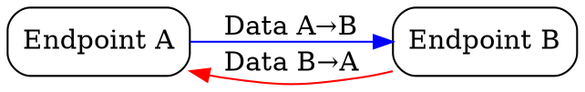
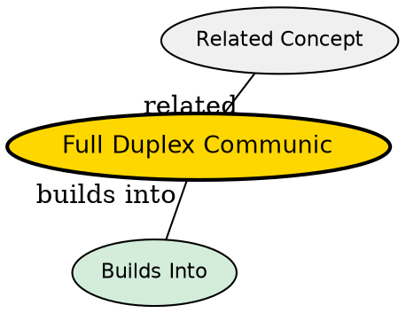

## The Problem
Some communication scenarios need both sides to send and receive data simultaneously. Half-duplex (one direction at a time) adds latency and complexity for interactive applications.

## Core Idea
A communication mode where both endpoints can send and receive data simultaneously, enabling true bidirectional communication.

## How It Works
1. Both endpoints have independent send and receive channels
2. Data can flow in both directions at the same time
3. Each direction is independent -- can have different data rates
4. Enables techniques like piggybacking (ACK on reverse-direction data)
5. TCP is full-duplex: both sides can send data simultaneously

## Visual Explanation

## Key Properties
- Simultaneous bidirectional data flow
- Each direction is independent
- Enables piggybacking of ACKs on data
- Used by TCP and most modern network protocols

## Semantic Network

## Connections
- Built from: [[tcp|TCP]] -- is full-duplex
- Related: [[piggybacking|Piggybacking]] -- relies on full-duplex
- Contrasts with: [[half-duplex|Half-Duplex]] -- one direction at a time
- Contrasts with: [[simplex|Simplex]] -- one direction only

## Edge Cases & Gotchas
- Not all links support full-duplex (some wireless is half-duplex due to single radio)
- Full-duplex Ethernet requires point-to-point links (no shared medium)
- Asymmetric data rates: one side may send much more than the other