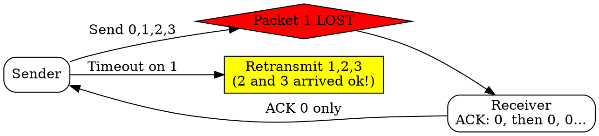

## The Problem
Sliding window allows sending multiple packets, but how should lost packets be handled? A simple approach is needed that doesn't require the receiver to buffer out-of-order packets.

## Core Idea
A sliding window protocol where the sender retransmits ALL unacknowledged packets from the lost packet onward when a packet is lost, even if later packets were received correctly.

## How It Works
1. Sender maintains a window of N unacknowledged packets
2. Receiver only accepts in-order packets, discarding out-of-order packets
3. Receiver sends ACK for the last in-order packet received (cumulative ACK)
4. If sender doesn't receive ACK for a packet before timeout, it retransmits that packet and ALL subsequent packets
5. Simple for receiver but can be wasteful — retransmitting packets that arrived correctly

## Visual Explanation

## Key Properties
- Simpler receiver: no need to buffer out-of-order packets
- Cumulative ACKs: single ACK can acknowledge multiple packets
- Potentially wasteful: retransmits packets that arrived correctly
- Window size typically limited to 2^n - 1 (n = sequence number bits)

## Connections
- Built from: [[sliding-window-protocol|Sliding Window Protocol]] — based on sliding window
- Contrasts with: [[selective-repeat|Selective Repeat]] — retransmit all vs only lost
- Related: [[cumulative-acknowledgment|Cumulative Acknowledgment]] — ACK mechanism used
- Related: [[automatic-repeat-request|Automatic Repeat Request]] — ARQ family of protocols

## Edge Cases & Gotchas
- High packet loss causes many unnecessary retransmissions
- Window size must be less than sequence number space/2 to avoid ambiguity
- Receiver simplicity comes at cost of bandwidth efficiency

## Sources
- [[cn-summary|Computer Networks Gemini Conversation]]
