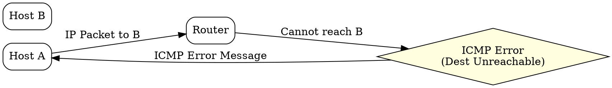
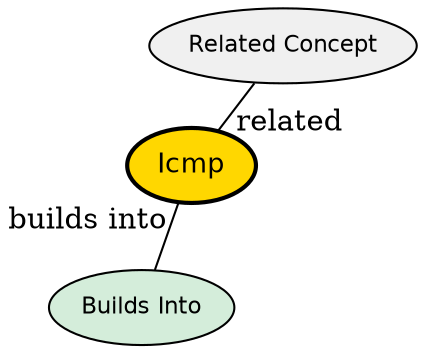

## The Problem
Network devices need a way to report errors (destination unreachable, TTL exceeded) and exchange diagnostic information. IP has no built-in mechanism for error reporting or network diagnostics.

## Core Idea
A network-layer protocol used by routers and hosts to send error messages and operational information about IP packet processing.

## How It Works
1. ICMP messages are encapsulated within IP packets (protocol number 1)
2. Error messages include a portion of the original IP packet that caused the error
3. Common message types: Destination Unreachable, Time Exceeded, Parameter Problem
4. Query messages: Echo Request/Reply (used by ping), Timestamp Request/Reply
5. ICMP is not used for data transfer -- only control and diagnostic information

## Visual Explanation

## Key Properties
- Network-layer protocol for error reporting and diagnostics
- Not a transport protocol -- doesn't carry application data
- Uses IP for delivery (ICMP packets are IP payload)
- Essential for network troubleshooting (ping, traceroute)

## Semantic Network

## Connections
- Built from: [[ip-protocol|IP Protocol]] -- encapsulated in IP packets
- Related: [[ping|Ping]] -- uses ICMP Echo messages
- Related: [[traceroute|Traceroute]] -- uses ICMP Time Exceeded
- Related: [[network-layer|Network Layer]] -- operates at this layer

## Edge Cases & Gotchas
- ICMP messages are not guaranteed to be delivered (they're best-effort like IP)
- Some firewalls block ICMP, breaking path MTU discovery and network diagnostics
- ICMP redirect messages can be security risks and are often disabled